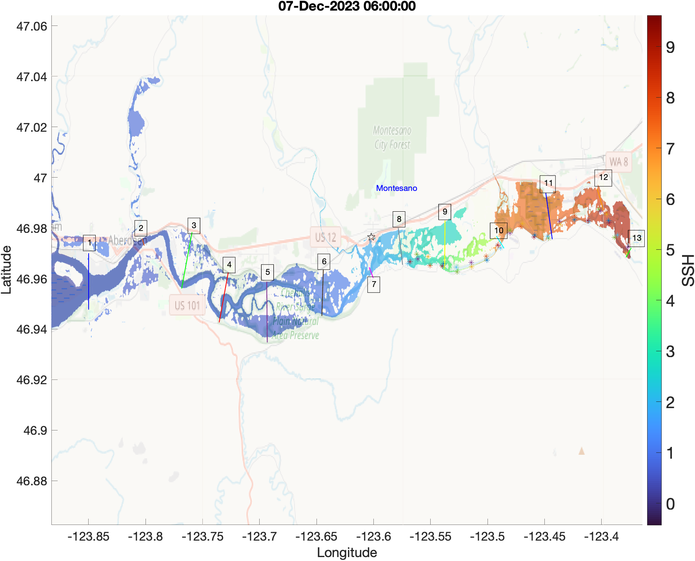
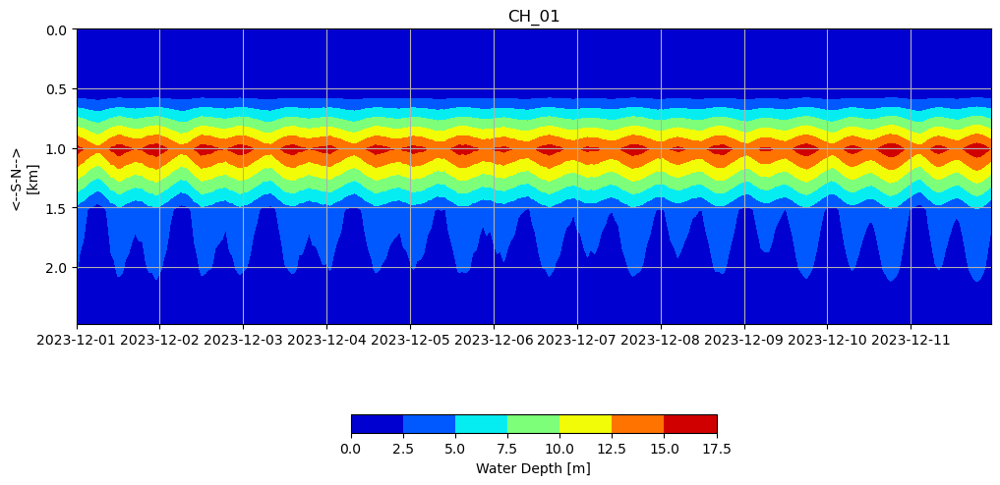
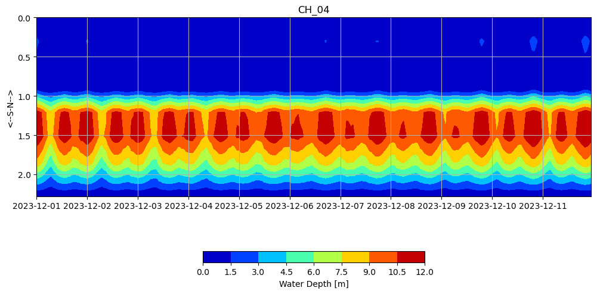
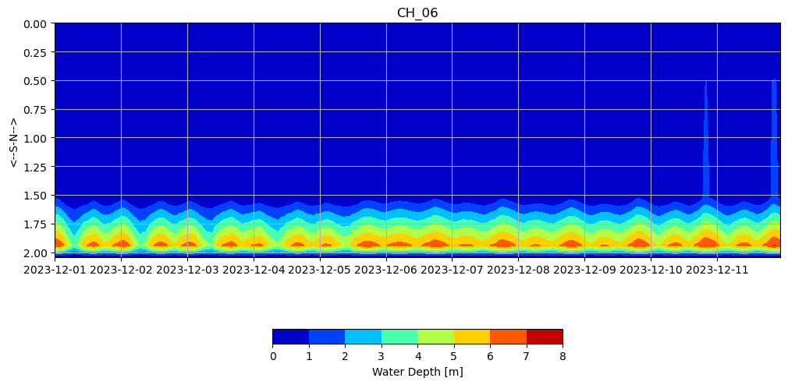
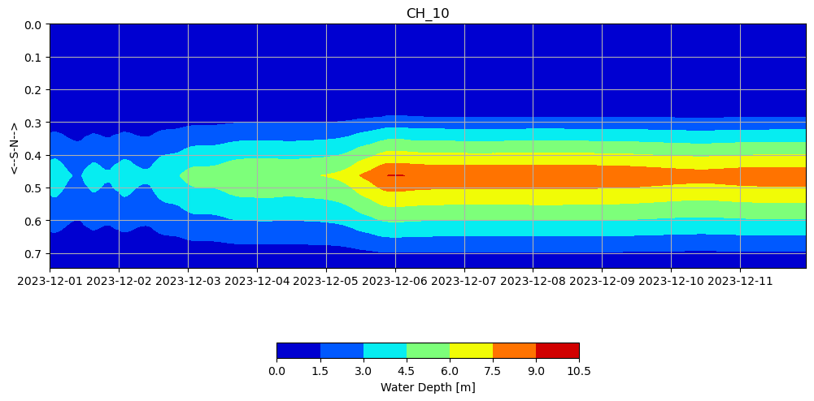
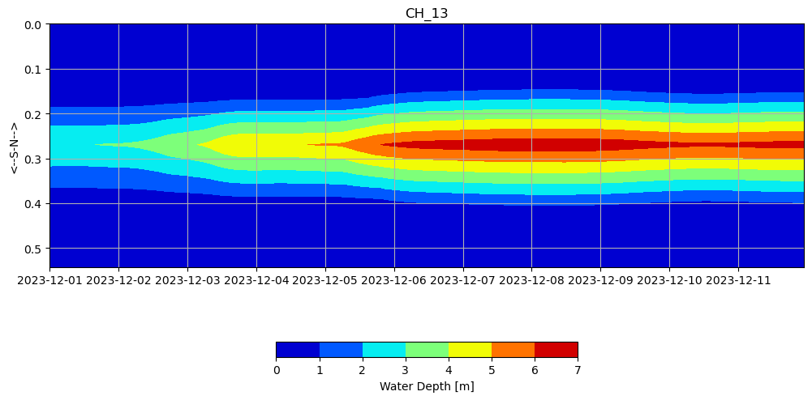

# October 06 - 12, 2024

## Summary:
1) Generated cross sections along Chehalis River based on max inundation observed for the December 2023 storm 
2) Plotted cross sectional area, discharge, and water levels  

## To do:
1) Run model (TMD) with v4 grid including new observation and discharge points
2) Cross-section profiles
3) Along-channel profiles
4) Team 2 meeting presentation 

## Results:
1) Cross sections for Chehalis River 
- Ran model TMD w/v4 grid (no weir)
- Chose transect points (13) based on max inundation (spaced ~4km apart) (Fig. 1)

 
Figure 1: Map of max inundation (Dec. 07, 2023 T06:00) with cross sectional transects (13).

2) Plotted cross sectional area, discharge, and water levels 
- Generated cross section file (CrsFile) for model to generate cross sectional area and discharge
- Plotted cross sectional area for each transect (Fig. 2)
- Plotted discharge for each transect (Fig. 3)
- Plotted cumulative discharge for each transect (Fig. 4)
- Plotted cross channel water depth profile for each transect (Fig. 5-17)

 
Figure 2: Cross sectional area for all transects (13).

 
Figure 3: Discharge for all transects (13).

 
Figure 4: Cumulative discharge for all transects (13).

 
Figure 5: Cross channel water depth profile (Transect 1).

 
Figure 6: Cross channel water depth profile (Transect 2).

 
Figure 7: Cross channel water depth profile (Transect 3).

 
Figure 8: Cross channel water depth profile (Transect 4).

 
Figure 9: Cross channel water depth profile (Transect 5).

 
Figure 10: Cross channel water depth profile (Transect 6).

 
Figure 11: Cross channel water depth profile (Transect 7).

 
Figure 12: Cross channel water depth profile (Transect 8).

 
Figure 13: Cross channel water depth profile (Transect 9).

 
Figure 14: Cross channel water depth profile (Transect 10).

 
Figure 15: Cross channel water depth profile (Transect 11).

 
Figure 16: Cross channel water depth profile (Transect 12).

 
Figure 17: Cross channel water depth profile (Transect 13).

### Team 2 meeting presentation
- Background + motivation
- Model grid/development
- Flood map/animation
- Thoughts on what to include as products
	- % inundated relative to MHW
	- shapefiles
	- 

## Issues:
- Transects at certain points (9, 11) are dry until storm arrival (Dec. 05)

## To do:
