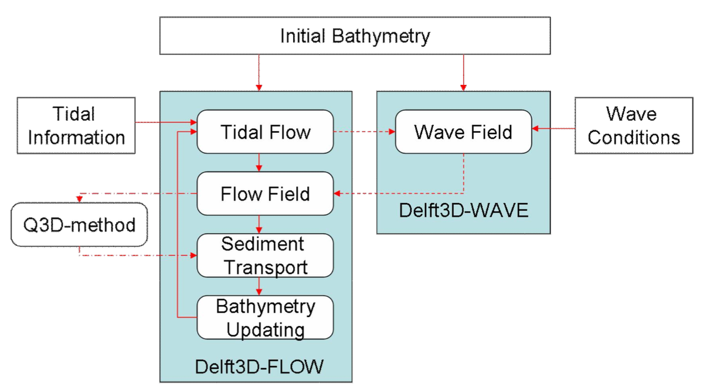

# October 08 - October 14, 2023
- Meet with Christie to discuss Deflt3D basics - (10/09)
- Create shared spreadsheet for monitoring stations in Willapa Bay, Grays Harbor, and surrounding area.
  - https://docs.google.com/spreadsheets/d/1Mqzt7Lxn9V12FRSPelFWJJG9nrxQnFr4MR76eoNUSmU/edit#gid=0
- Research more into Delft-FM architecture and tools.
  - Begin reading Delft-FM manual (https://content.oss.deltares.nl/delft3d/D-Flow_FM_User_Manual.pdf)

- General research ideas for dissertation:
  - ADCP/water level gauges at mouth of Willapa River.
    - Measure propagation of waves after shoal at bay mouth.
      - Time lag for wave propagation.
    - Investigate hydrodynamics that dampen/amplify inflow/outflow at mouth.
      - Flow gauge is located east of Raymond.
    - Look at velocity profiles during peak and after during relaxation to observe any density driven flows/circulation from interaction between ocean inflow and freshwater outflow.
  - Water level gauges at Nahcotta Port (potential outwash/overtopping investigation).
  - Lidar survey of waves and beach evolution, wave behavior over the shoal? during storm events.
    - Wave run up, set up, to infer ebb shoal migration placement and migration.

