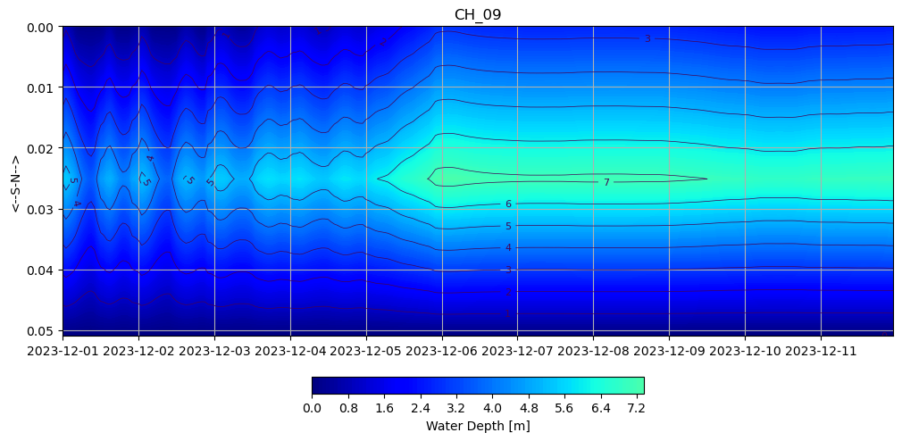
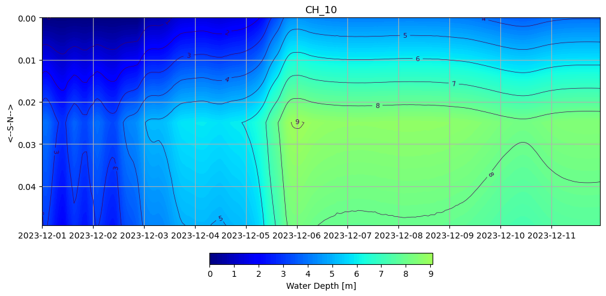

# October 13 - 19, 2024

## Summary:
1) Ran DFM model (v4) with discharge output for Chehalis River channel 
2) Plotted cross sectional area, discharge, and water levels 

## To do:
1) Create new transect points for main channel and add observation points for cross section 

## Results:
# 1) Discharge for main channel
- 

 
Figure 1: Cross channel water depth profile (Transect 1).

 
Figure 2: Cross channel water depth profile (Transect 2).

 
Figure 3: Cross channel water depth profile (Transect 3).

 
Figure 4: Cross channel water depth profile (Transect 4).

 
Figure 5: Cross channel water depth profile (Transect 5).

 
Figure 6: Cross channel water depth profile (Transect 6).

 
Figure 7: Cross channel water depth profile (Transect 7).

 
Figure 8: Cross channel water depth profile (Transect 8).

 
Figure 9: Cross channel water depth profile (Transect 9).

 
Figure 10: Cross channel water depth profile (Transect 1).

 
Figure 11: Cross channel water depth profile (Transect 11).

 
Figure 12: Cross channel water depth profile (Transect 12).

 
Figure 13: Cross channel water depth profile (Transect 13).