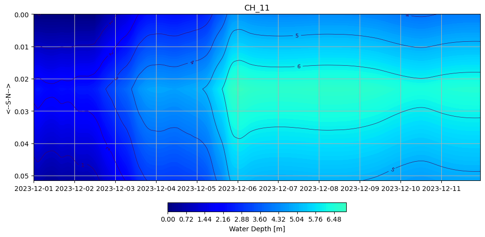
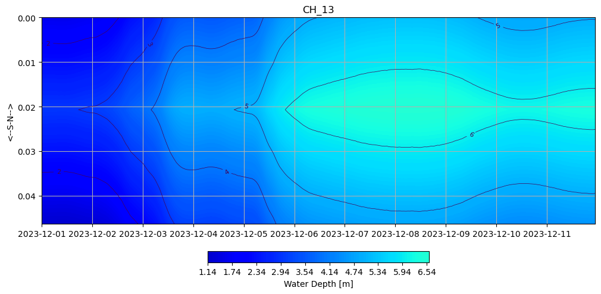

# October 13 - 19, 2024

## Summary:
1) Ran DFM model (v4) with discharge output for Chehalis River channel 
2) Plotted cross sectional area, discharge, and water levels 

## To do:
1) Create new transect points for main channel and add observation points for cross section 

## Results:
### 1) Water depths, cross sectional area, discharge for Chehalis River main channel
- Map of Chehalis River with transects plotted for the main channel (Fig. 1)
	- Transect much smaller but do well at representing the main channel of the Chehalis
- Cross sectional area for all 13 transects from December 1-12, 2023 (Fig. 2)
	- Modulating cross sectional area for transects 1-10 for the first ~5 days can be described by the extent of tidal influence
	- Cross sectional area remains elevated for longer duration in transects 9 to 12 due to lack of tidal flushing
- Modulations in total discharge are evident transects 1-9 due to the tidal influence (Fig. 3)
	- Interestingly, discharge drops abruptly right after the peak on late December 05 for transect 11 (can be seen in transect 12 slightly as well)
	- Discharge at transect 13 follows the Montesano discharge rate until late December 5, where the discharge begins to become underestimated. This shows that water levels have potentially spilled over bank and inundated the floodplain, which can be seen in last week's plots where discharge along the floodplain made up for the difference in discharge.
- Cumulative discharge shows downstream transects flush larger volumes of water later in the time series (Fig. 4)
- Cross section velocity was calculated from cross section discharge/cross section area (Fig. 5)
	- Maximum velocity magnitude is ~2 m/s at transect 9
	- Transects 1-8 have >1 instance of velocity <0, which indicates inflow (from tides)
	- Velocity at transects 9-13 are always >0 m/s, indicating outflow for the entire time series
	- Velocity reaches magnitudes of 2 m/s  at transect 9
- Cross-section water depth profiles for transects 1-13 (Fig. 6-18)
	- From transects 1-9, we can see the widening and narrowing of the channel due to the tidal cycle prior to December 5

 
Figure 1: Map of max inundation (Dec. 07, 2023 T06:00) with cross sectional transects (13).

 
Figure 2: Cross sectional area for all transects (13).

 
Figure 3: Discharge for all transects (13).

 
Figure 4: Cumulative discharge for all transects (13).

 
Figure 5: Cross sectionally averaged velocity for each transect.

 
Figure 6: Cross channel water depth profile (Transect 1).

 
Figure 7: Cross channel water depth profile (Transect 2).

 
Figure 8: Cross channel water depth profile (Transect 3).

 
Figure 9: Cross channel water depth profile (Transect 4).

 
Figure 10: Cross channel water depth profile (Transect 5).

 
Figure 11: Cross channel water depth profile (Transect 6).

 
Figure 12: Cross channel water depth profile (Transect 7).

 
Figure 13: Cross channel water depth profile (Transect 8).

 
Figure 14: Cross channel water depth profile (Transect 9).

 
Figure 15: Cross channel water depth profile (Transect 1).

 
Figure 16: Cross channel water depth profile (Transect 11).

 
Figure 17: Cross channel water depth profile (Transect 12).

 
Figure 18: Cross channel water depth profile (Transect 13).

## To do:
- Run model with different grid version and compare cross channel profiles, discharge, and along-channel profile
- Put cross sections along Wynoochee and Satsop
- Calculate difference in discharge between floodplain cross sections and channel cross sections for determining how much water is leaked into the floodplains
