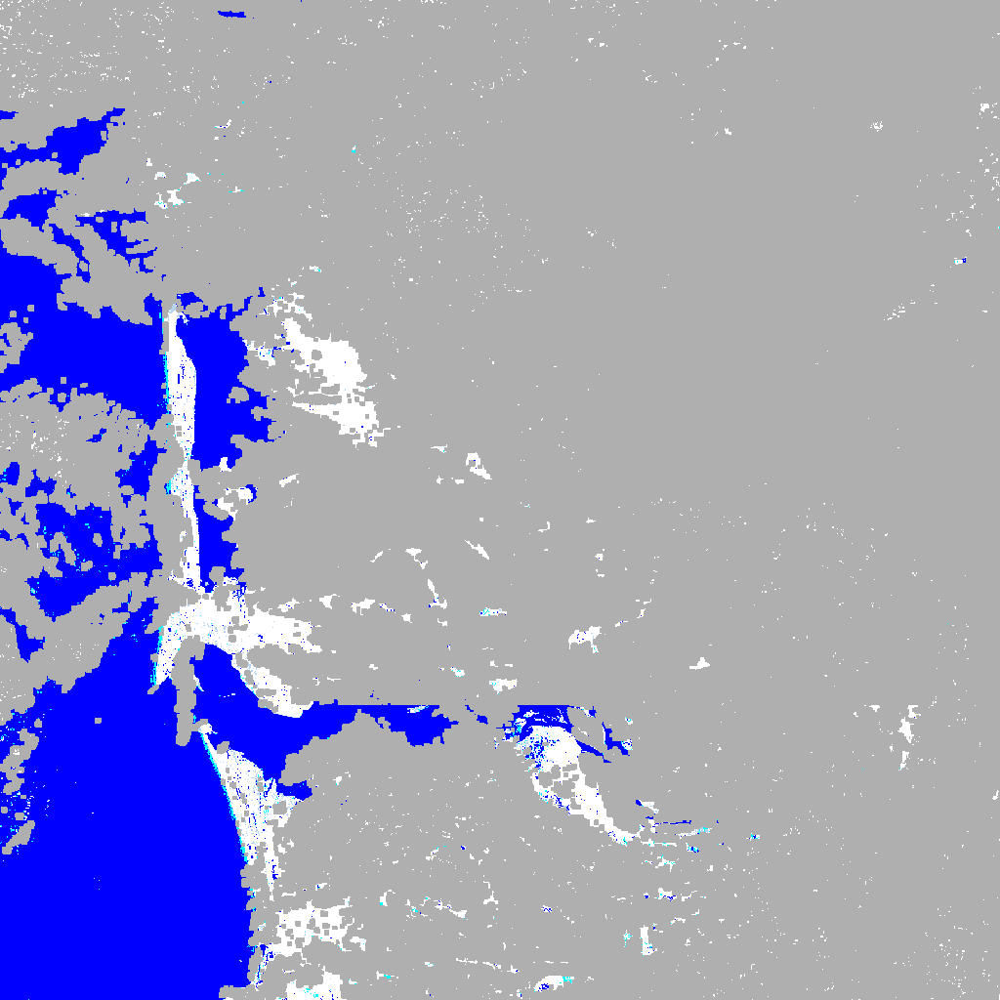
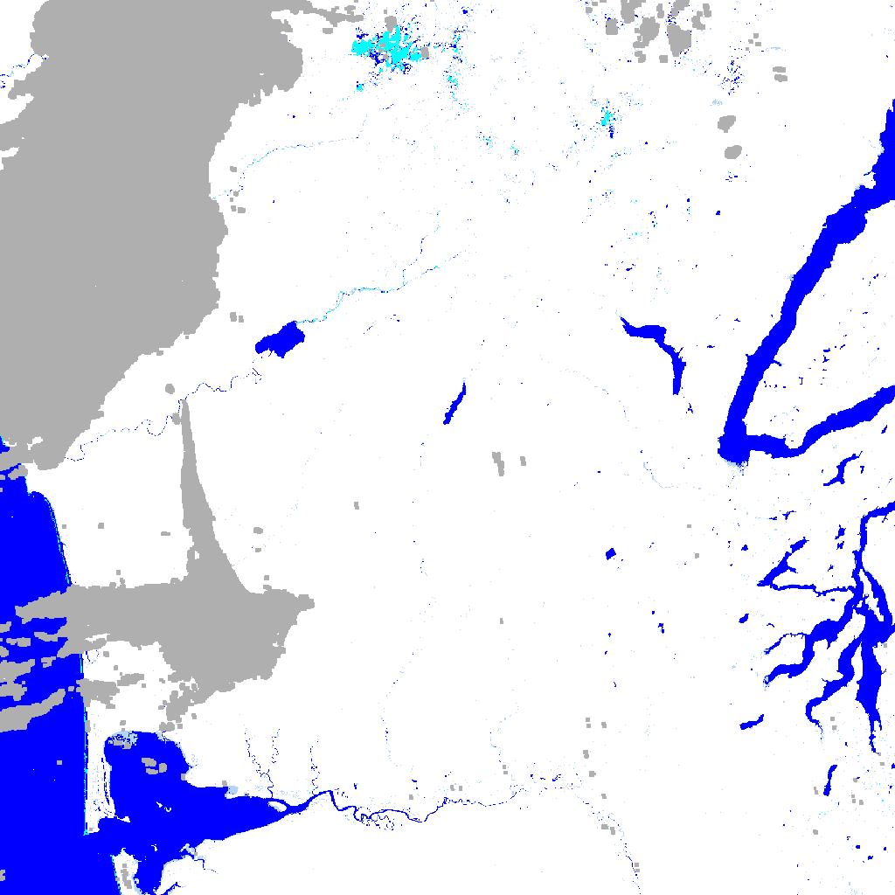

# October 20 - 26, 2024

## Summary:
1) Winter Storms Forum flyer and generate DSWx-HLS and DSWx-S1 images for Twin Harbors  
2) Worked on generating water layers for optical and radar images

## Results:
### 1) Winter Storms Forum flyer and poster
https://docs.google.com/document/d/1YWU2EE9Ks3Gs3yYOffuMgGM4EqTluAV7Ok8Q2t_sfXA/edit?usp=sharing

 
Figure 1: Winter Storms Forum DSWx BWTR map (v1).

### 2) DSWx water layers
- Sifted through DSWx-HLS (optical) records and found many images for Twin Harbors, but always had cloud cover during storm events (e.g. Dec. 2023) (Fig. 2)
- Sifted through DSWx-S1 (radar) records which have images starting on 09-16-2024 in Twin Harbors (Fig. 3,4)
- There exist recent images that show the benefits of having the radar product, showing surface water extent without any influence of cloud cover
	- Optical image on 09-21-2024T191009Z (Fig. 5)
	- Radar image on 09-21-2024T021106Z (Fig. 6)
- Visualizing water layers from .tif files
	- Water layer (WTR) shows: 1) Open Water, 2) Partial Surface Water, 3) Snow/Ice, 4) Cloud/Cloud Shadow (unsure what 'Reserved' is) (Fig. 7) 
	- Binary water layer (BWTR) merges 'open water' and 'partial surface water' pixels together (Fig. 8)
	- Confidence layer (CONF) shows confidence for each classification (Fig. 9)

 
Figure 2: Twin Harbors optical image on December 13, 2023.

 
Figure 3: Willapa Bay radar image on September 16, 2024.

 
Figure 4: Grays Harbor radar image on September 16, 2024.

 
Figure 5: Optical image on September 21, 2024.

 
Figure 6: Radar image on September 21, 2024.

 
Figure 7: Water layer on September 21, 2024.

 
Figure 8: Binary water layer on September 21, 2024.

 
Figure 9: Confidence layer on September 21, 2024.

## To do:
- Continue working on analytical model