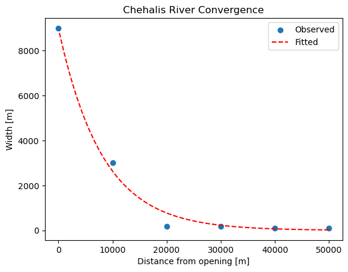
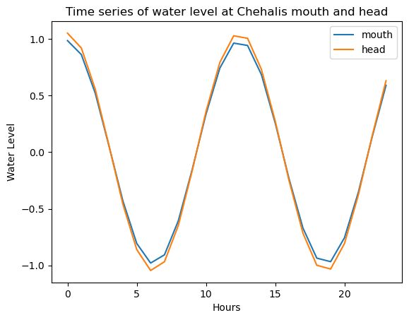
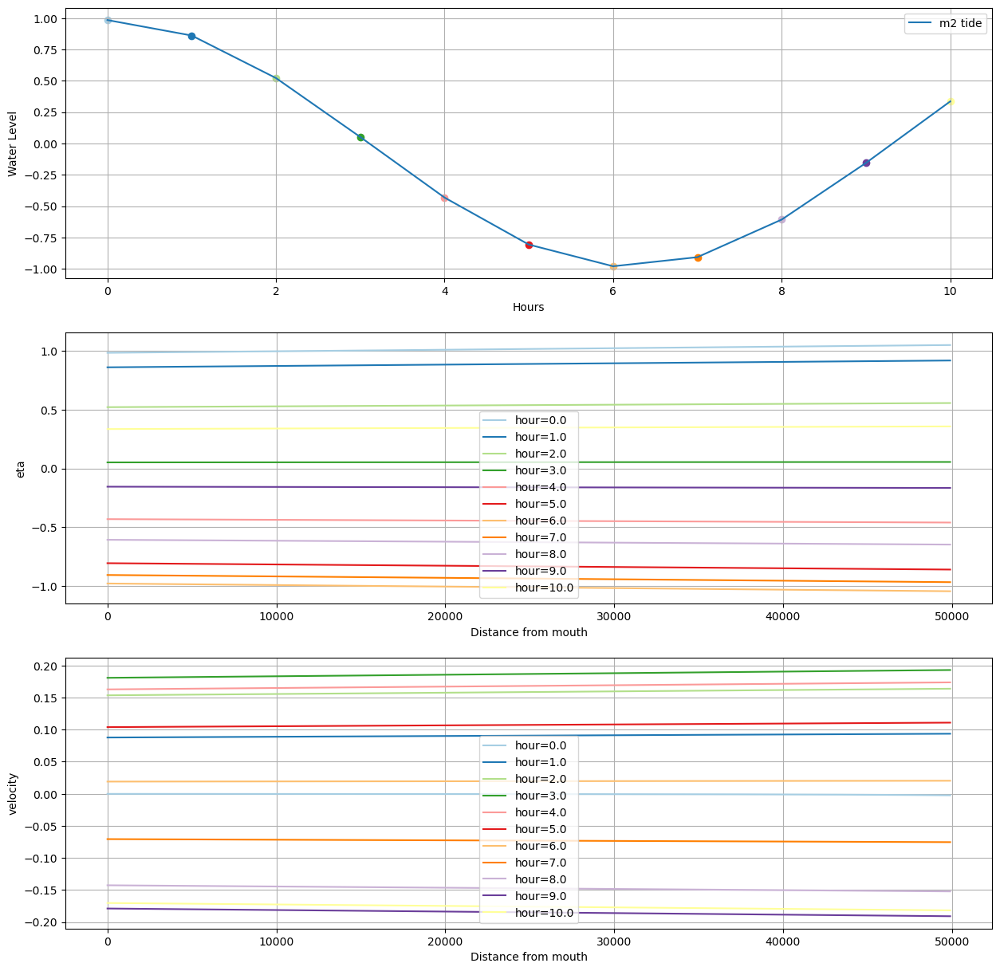
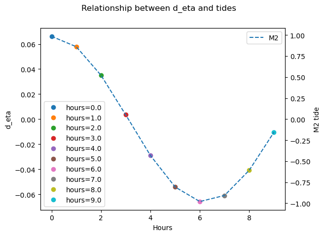

# October 27 - November 02, 2024

## Summary:
1) Attended Winter Storms Forum
2) Analytical model

## Results:
### 1) Winter Storms Forum
- Major theme for storms:
	- Jan 2021
	- Jan 2022
- Kelly Smith (WDFW): connected us with Chris Alston (PM) and Frank Stevick (lead permitter) for South Montesano Public Access site project
	- Bathymetric survey from October 25, 2022 for stretch along Montesano (Cutoff Slough)
- Marshall Read (Shoreline Administrator, City of Ocean Shores): spoke about high rates of erosion (~20ft/yr) along eastern stretch of Ocean Shores due to wind fetch from offshore winds
	- Shallow aquifer ponds store freshwater that are vulnerable to contamination by salt water
	- Salt water intrusion/breaching near Oyhut
	- Dana Point tip disappeared after Jan 2022 storm (king tides, 12" snow, etc)
- Scott McDougall (Director of Pacific County EM agency): minor flood stage (21ft) @ Willapa River experienced annually
	- 2021 storm saw 18ft at river, mostly driven by wind and extremely low pressure system)
	- For hazard mitigation, mostly use historical info, written record, FEMA flood maps
- ACRE (applied coastal research engineer team) potentially for mapping records?
	- CMAP (coastal monitoring analysis program)

### 2) Analytical model
- Adapting Van Rijn's (2011) analytical model approach for convergent estuaries
	- Uses width convergence length scale to characterize along-channel width (Fig. 1)
	- Assumes:
		- Constant depth/bottom horizontal
		- PG and friction balance
		- Friction linearized
		- M2 tide as boundary condition
- Modeling water levels along channel over 24 hours, eta is amplified during the peak high and low tides (Fig. 2)
	- This agrees with behavior of amplified tides in convergent estuaries
- Velocity lags in response to water tidal (Fig. 3)
	- Velocity increases (outflow?) as tides and water levels drop
	- Tides and eta reach low at hour 6 (light orange)
	- Velocity changes sign (decreases) after hour 3 (dark green)
		- Velocity also changes sign (increases) after hour 9 (dark purple), so 3 hours after tides begin rising
- Direct relationship between d_eta (eta_head - eta_mouth) and tidal amplitude (Fig. 3)

 
Figure 1: Optimized curve fit for convergence width scale (Chehalis River).

 
Figure 2: Amplified water level signal at head compared to mouth.

 
Figure 3: (a) M2 tidal signal with colored dots corresponding to hours. (b) Along channel eta for the first 11 hours. (c) Along channel velocity for the first 11 hours.

 
Figure 4: Relationship between d_eta (eta_head - eta_mouth) and the M2 tidal signal.

## Next Steps:
- Continue analytical model
	- Adapt to account for converging depth
	- Include more tide to simulate mixed semidiurnal tides
	- Match BCs with predicted tides for December 2023 storm
	- Decompose storm surge signal and incorporate
