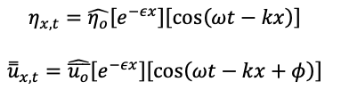
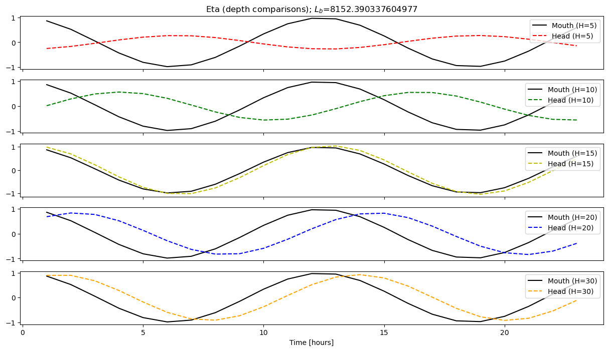
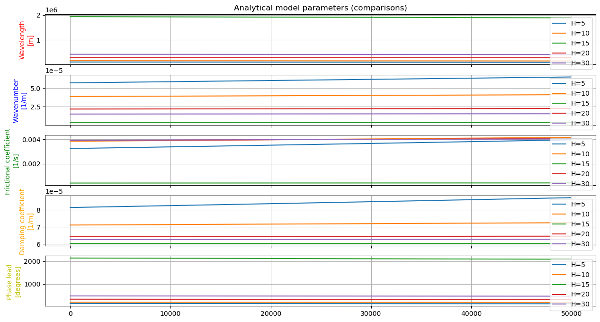
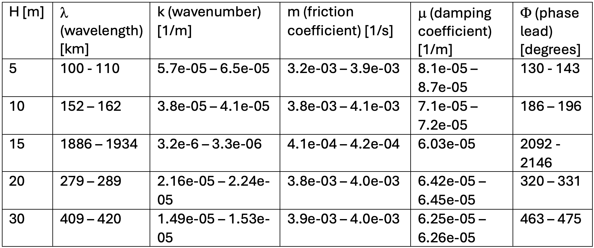
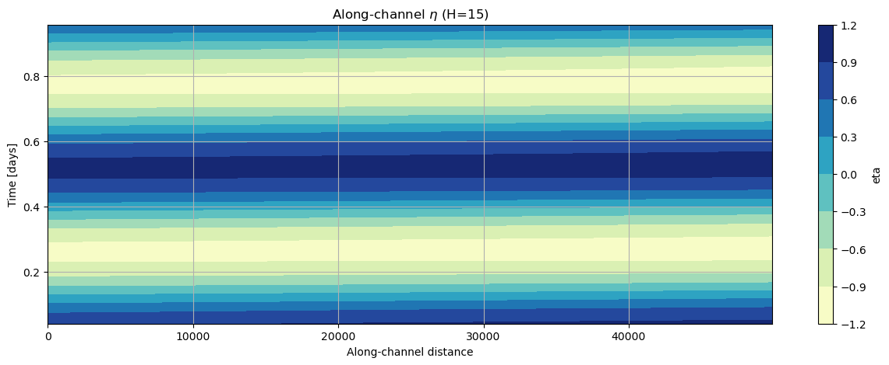
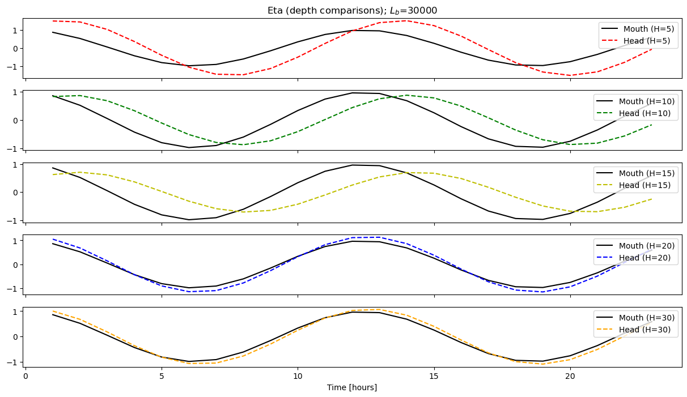
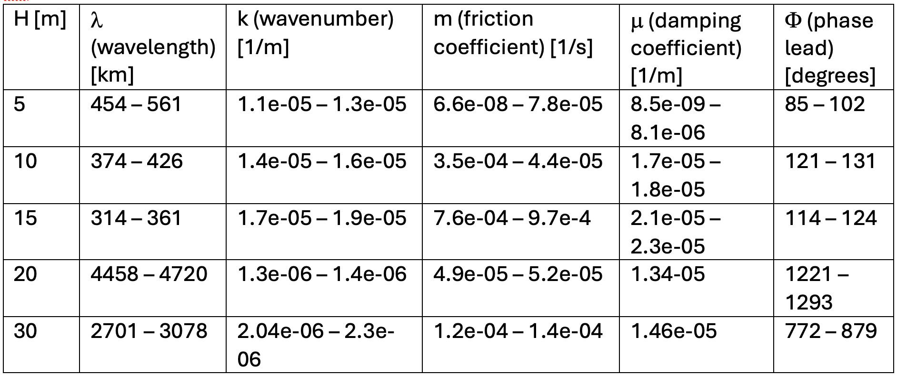

# November 03 - 09, 2024

## Summary:
1) Analytical model

## Results:
### Equations for analytical model

 
 
 
 

### 1) Varying depth (for Lb = 8100)
- Mouth and head water levels for varying depths (5m, 10m, 15m, 20m, 30m) - Fig. 1
	- Phase shift for all cases, but only reasonable for H=5m,10m case
	- All "head" signals were damped except for H=15m

 
Figure 1: Eta at the mouth and head for different depths  (Lb=8100).

- Parameters (wavenumber/wavelength, friction coefficient, damping coefficient, and phase lead) for varying depths - Fig. 2, Table 1
	- Wavelength for most depths are on the order of 100-400km and increases with depth, with the exception of 15m (extremely large, 10^3)
	- Friction coefficient (m) for most depths are on the same order O(-3) except for depth of 15m O(-4)
	- Damping coefficient becomes smaller with increasing depth (as expected)
	- Phase lead (phi) gradually becomes larger with the exception of 15m depth

 
Figure 2: Comparisons between parameters in analytic solution.

 
Table 1: Comparisons between parameters for different depths (Lb=8100).

- Looked at along channel eta and u for varying depths
	- Eta is relatively flat (small along channel change) for H-15m (Fig. 3)

 
Figure 2: Along channel eta over time for H=15m.

## 2) Varying width convergence
- Changing L_b to 3000 (faster convergence)
- Mouth and head water levels for varying depths (5m, 10m, 15m, 20m, 30m) - Fig. 4
	- Phase shift for all cases, but only reasonable for H=5m,10m case
	- "Head" signals were amplified for H=5m, 20m, and 30m and just slightly damped for H=10m and 15m

 
Figure 4: Eta at the mouth and head for different depths (Lb=3000).

- Parameters (wavenumber/wavelength, friction coefficient, damping coefficient, and phase lead) for varying depths - Fig. 5, Table 2
	- Wavelength for most depths are on the order of 100-400km and increases with depth, with the exception of 15m (extremely large, 10^3)
	- Friction coefficient (m) for most depths are on the same order O(-3) except for depth of 15m O(-4)
	- Damping coefficient becomes smaller with increasing depth (as expected)
	- Phase lead (phi) gradually becomes larger with the exception of 15m depth

 
Table 2: Comparisons between parameters for different depths (Lb=3000).

## Issues:
- Phase shift issue (especially at H=15m)
- Wavenumber/wavelength issue (especially at H=15m)
- Inflection point somewhere between 10m, 15m, and 20m

## Next Steps:
- Compare parameter values with other literature