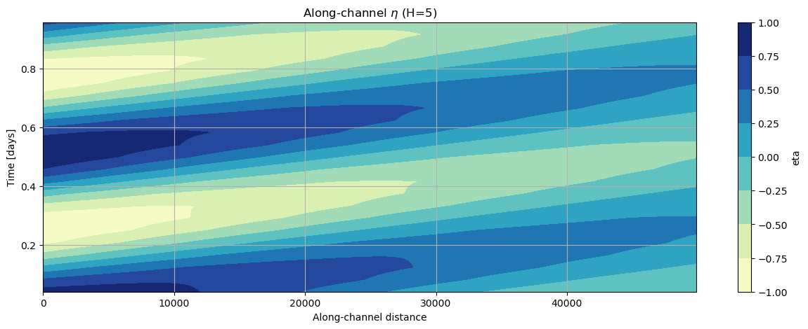

# November 03 - 09, 2024

## Summary:
1) Analytical model

## Results:
### 1) Varying depth (for Lb = 8100)
- Mouth and head water levels for varying depths (5m, 10m, 15m, 20m, 30m) - Fig. 1

[Eta over depths](../Figures/110724meeting/headvmouth_comparisons_Lb8100.png) 
Figure 1: Eta at the mouth and head for different depths.

- Parameters (wavenumber/wavelength, friction coefficient, damping coefficient, and phase lead) for varying depths - Figs. 2
	- Wavelength for most depths are on the order of 100-400km, except for 15m (extremely large, 10^3)
	- 

[Comparing parameters](../Figures/110724meeting/modelparameters_comparisons_Lb8100.png) 
Figure 2: Comparisons between parameters in analytic solution.

- Looked at eta and u for varying depths (5m, 10m, 15m, 20m, 30m) - Lb = 8100 (optimized width scale)
	- Eta starts very damped at 5m and becomes amplified at 15, 30, and 50m
	- Eta is weirdly damped at 20m
	- Eta is flatter for H=15 than other depths
- Wavelength for all depths are on the order of 100-400,000, except for 15m (extremely large, 10^6)
- Phase lag observed for signal at the head, but varies depending on depth

## 2) Varying width convergence
- Changing L_b to 

## Issues:
- Phase shift issue (especially at H=15m)
- Wavenumber/wavelength issue (especially at H=15m)
- Inflection point somewhere between 10m, 15m, and 20m

## Next Steps:
- Compare parameter values with other literature

 
Figure 1.