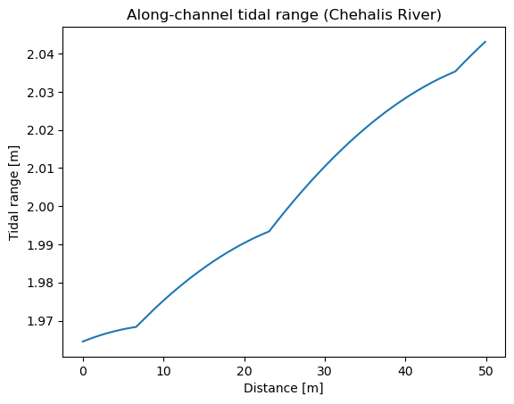
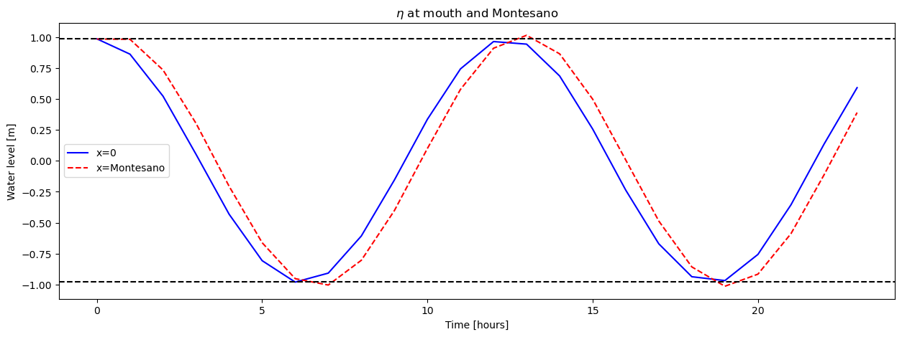
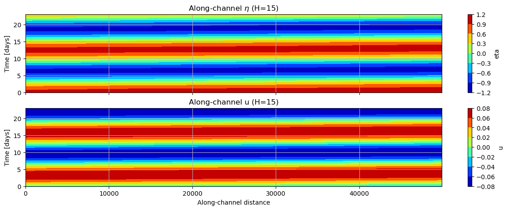
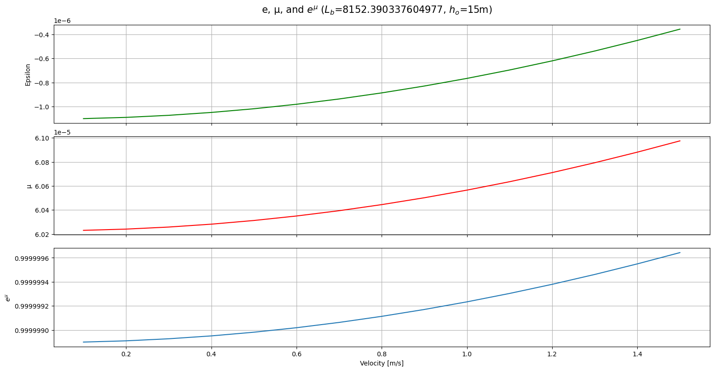
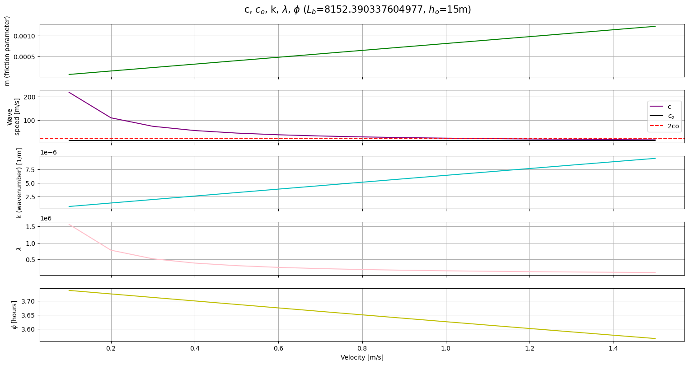

# November 17 - 23, 2024

## Summary:
- Analytical model

## Results:
### Added in amplification and damping regimes
- Accounted for different k and mu equations depending on which regime the system is in (amplifying or damping)

### Amplified tidal range
- Amplitude at mouth = 1.96m
- Amplitude at Montesano = 2.02
- Only 6cm difference in tidal amplitude
- Phase shift = 3.62 hours (Fig. 2)
- Evolution of eta and u over space and time (Fig. 3)

 
Figure 1: Along-channel tidal range.

 
Figure 2: Eta at the mouth and Montesano.

 
Figure 3: Eta and u over space and time.

### Varied initial velocity
- Varied velocity from 0.1 to 1.5 m/s to look at responses in parameters
- Epsilon, mu, and e^(epsilon) (Fig. 4):
	- All variables increase as you increase velocity
	- e^(epsilon) approaches 1, which explains why tidal range doesn't increase by much
- m, c, co, k, lambda, and phi (Fig. 5):
	- m (friction coefficient) increases as you increase velocity
	- c (wave speed) starts real high at low velocity
		- Dashed redline denotes when c=2co (Van Rijn's finding), which is around 0.9-1 m/s
	- k increases as you increase velocity
	- wavelength decreases as you increase velocity
	- phi (phase lag) decreases as you increase velocity (as expected)
- Changing velocity doesn't change tidal range much at Montesano
- Phase shift decreases as you decrease velocity

 
Figure 4: Epsilon, mu, and e^(epsilon) for L_b=8142, h_o=15m.

 
Figure 5: c, c_o, k, lambda, and phi for L_b=8142, h_o=15m.

## Issues:
- Varying L_b doesn't always match regime
	- Increasing L_b where it's still amplified results in damped tidal range (unless I choose extremely large L_b)

## Next steps:
- Continue working on matching Van Rijn's Scheldt Estuary results
- Add in tidal constituent in Chehalis River analytical model