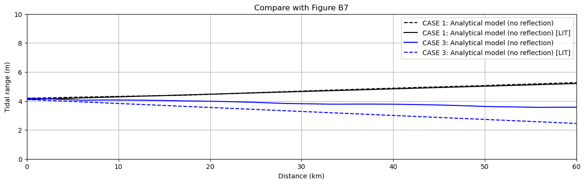

# November 24 - December 07, 2024

## Summary:
- Recreate plots from Van Rijn's (2010) paper

## Results:
### Amplification and damping in an estuary with exponential width
- Tried to recreate Figure 3.7 in the paper (Fig. 1)
- Did well for amplification regime
- c/co does not work well, but for the Lb in the Scheldt, it mostly agrees

 
 
Figure 1: Amplification and damping in an estuary with exponential width.

### Comparing water level and velocity at x=50km and x=0m for ks=0.03m (Scheldt)
- Water levels closely align with paper's Figure 4.5 (Fig. 2)
- Velocity still underestimates

 
 
Figure 2: Water level and velocity at x=50 km and x=0 m for k_s=0.03 m, Scheldt Estuary.

### Comparing water level and velocity at x=50km and x=0m for ks=0.03m (Scheldt)
- Along channel water level amplitude align with paper's Figure 4.6 (Fig. 3)
- Velocity is still not correct

 
 
Figure 3: Water level amplitude and velocity amplitude along estuary, Scheldt Estuary.

### Comparing along channel tidal range for Case 1 and Case 3
- Case 1: Converging width over 60km (width b_o=25,000 m, b_L=60km = 2,000 m), depth h=10 m, k_s=0.05 m
- Case 3: Converging width over 60km (width b_o=25,000 m, b_L=60km = 2,000 m), depth h=5 m, k_s=0.05 m
- Case 1 agrees with paper's Figure B7 (Fig. 4)
- Case 3 does not, does not get down to paper's ~2.5m tidal range

 
 
Figure 4: Computed tidal ranges for converging channel CASES 1 and 3 (L=60 km; h=10 and 5 m) based on analytical model.

## Issues:
- Something wrong with calculating velocity
- CASE 3 tidal range doesn't match paper's

## Next steps: