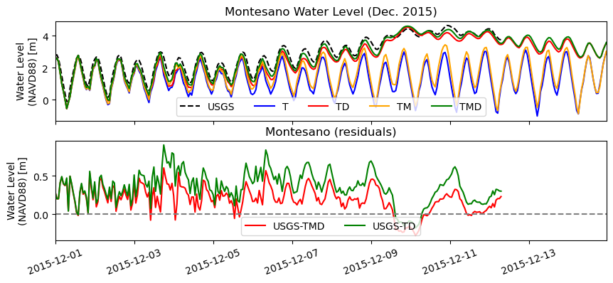
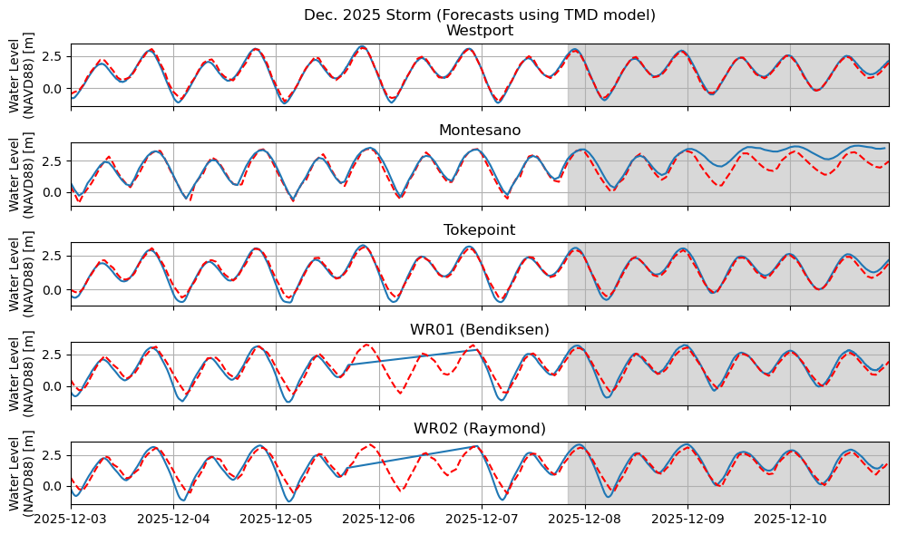
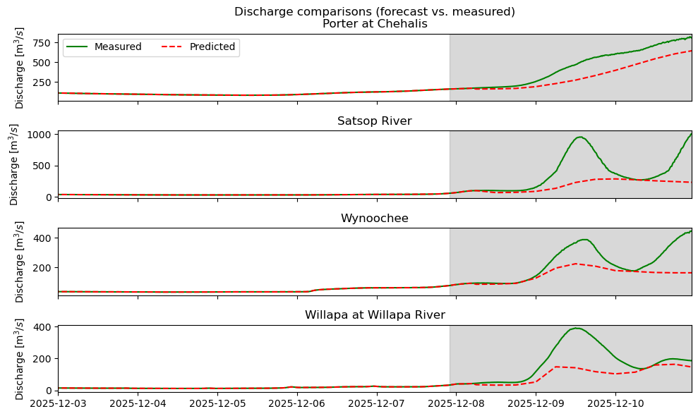
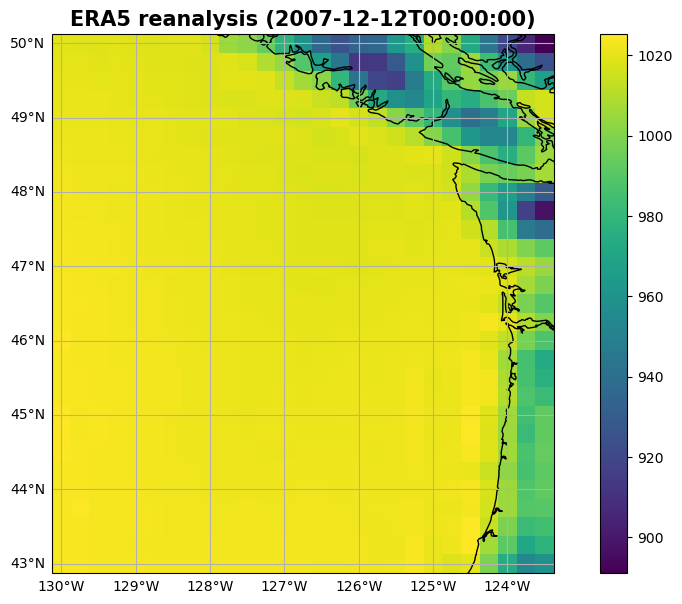

# December 07 - 13, 2025

## Summary+takeaways:
1) Jan2015 storm analysis 
* To accurately model the entire Grays Harbor system including the Chehalis River, we need tides, discharge, and MET (TMD) to accurately model upstream and the mouth of the bay 
2) Dec2025 storm forecast 
* Able to predict water levels at Westport, Tokepoint but Montesano water levels could be affected by inaccurate predicted river discharge used for the model; WR01 and WR02 did reasonably well 
3) Dec2007 MET reanalysis 
* Found ERA5 reanalysis dataset but super coarse relative to our usual 4km resolution WRF data

## Results:
### 1) Jan2015 storm analysis
* Ran T, D, TD, TM, and TMD model runs
* To accurately model the entire Grays Harbor system including the Chehalis River, we need tides, discharge, and MET
* Water level comparisons between different models (T, TD, TM, TMD) tell us that:
	* MET makes the largest difference in accurately predicting water levels at the Westport tide gauge (Fig. 1)
	* Adding in MET along with discharge gives us a more accurate prediction for water levels at the upstream Montesano station with (Fig. 2)

 
Figure 1: Comparing water levels at Westport between USGS gauge and model runs (T, TD, TM, and TMD) (top). Subtracting the water levels from the measured Westport gauge shows the TM and TMD models have the smallest residual (bottom). 

 
Figure 2: Comparing water levels at Montesano between USGS gauge and model runs (T, D, and TD) (top). Subtracting the water levels from the measured Montesano gauge shows the TMD model having the smallest residual (bottom). 

### 2) Dec2025 forecast model runs
* Modeled Dec. 03-11, 2025 (forecasting starting from 11/07/25 22:00)
* Did not complete TMDW model run
	* Did not complete due to HYAK maintenance
	* With 4 nodes, 36 tasks per node, and 1,400G of memory, estimated to take ~3 days to run
* Completed TMD model run (Fig. 3)
	* Model did well near entrance of Grays Harbor and Willapa Bay
	* Montesano forecasted water level did not dampen and increase as much as observed
	* Water levels at WR01 and WR02 show a shift in phase during falling tides, but agree well during the forecasted period
	* Predicted and observed discharge rates differ tremendously, which could have drastically affected the upstream water level response for Montesano (Fig. 4)

 
Figure 3: Comparing water levels from observed data and forecasted water levels using our TMD model.

 
Figure 4: Showing differences between predicted discharge rates and observed discharge rates at Porter, Satsop, Wynoochee, and Willapa gauges. 

### 3) Dec2007 reanalysis
* Using ECMWF ERA5 renanalysis hourly dataset to recreate MET forcing for Dec2007 storm (Fig. 5)
	* https://cds.climate.copernicus.eu/datasets/reanalysis-era5-single-levels?tab=download
	* Most accessible and downloadable dataset I could find
	* Resolution pretty coarse though (27.8 by 19.2 km)
	* Need to compare pressure measured at Westport as sanity check

 
Figure 5: Pressure map of ERA5 reanalysis for Dec. 12, 2007 (lowest pressure during the storm period).

## Next steps:
* More thorough analysis of December 2015 storm
	* Create along channel/spatial difference map showing discharge and MET contributions
	* Recreate Fig. 5,6, and 8 from Bao et al. (2024) showing:
		* Spatial maps of compound flood peak, max compound effect contribution, nonlinear effect contribution
		* Temporal and spatial evolution of the channel under different processes
* Finish interpolating Dec. 2007 MET data and run model
* Run Dec.2025 storm with observed data (discharge and MET forcing) to see if it is more accurate than our predicted forecast