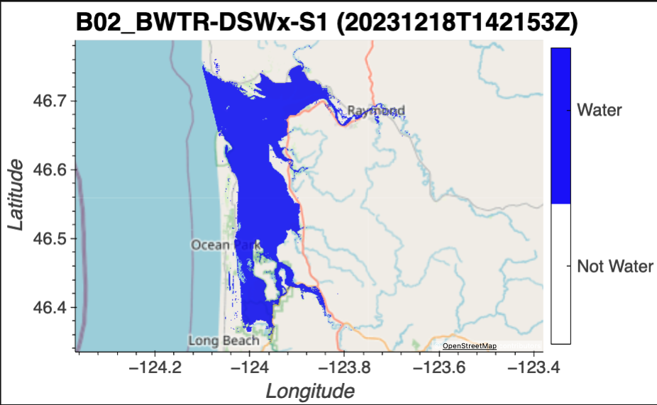
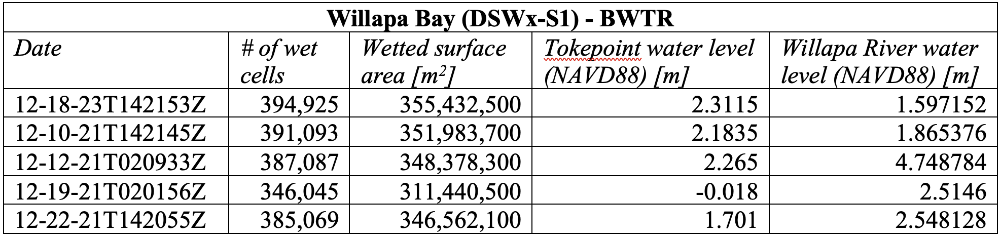
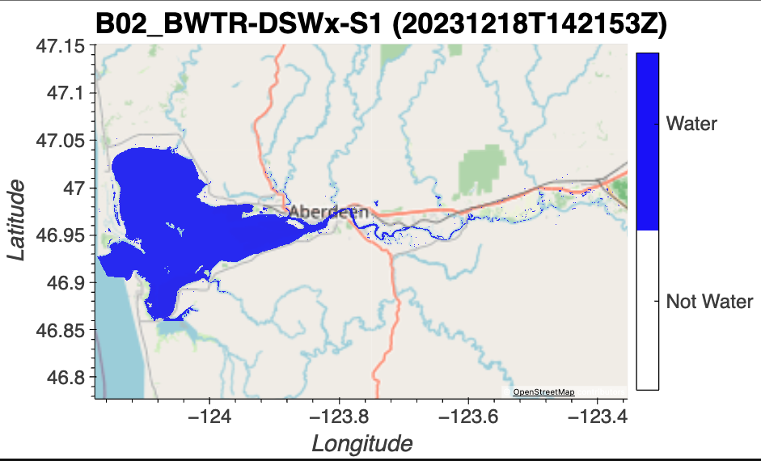

# December 08 - 14, 2024

## Summary:
1) DSWx

## Results:
### Surface area
- Calculated wetted cells and wetted surface area for available radar images (Willapa Bay and Grays Harbor):
	- 12/10/2021
	- 12/12/2021
	- 12/16/2021
	- 12/19/2021
	- 12/22/2021
	- 12/28/2021
	- 01/09/2022
	- 01/21/2022
	- 12/18/2023
- Isolated each system within bounds (Fig. 1, 2)

 
Figure 1: DSWx bounds for Willapa Bay. 

 
Table 1: Number of wetted cells, wetted surface area and water levels at Tokepoint and Willapa River gauges for available radar images. 

 
Figure 2: DSWx bounds for Grays Harbor. 

 
Table 2: Number of wetted cells, wetted surface area and water levels at Westport and Montesano gauges for available radar images. 

- Number of wetted cells and wetted area are linearly correlated as expected (Fig. 3a, 4a)
- Wetted area calculated is more correlated with water levels near the mouth compared to upstream gauges (Willapa, Montesano) (Fig. 3b, 4b).

 
Figure 3: Willapa Bay -(a) Number of cells vs. wetted area, (b) wetted area vs. gauge heights. 

 
Figure 4: Grays Harbor - (a) Number of cells vs. wetted area, (b) wetted area vs. gauge heights. 

## Issues:

## Next steps:
- Figure out how to isolate the domains better for calculating wetted surface area

 
