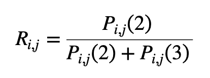
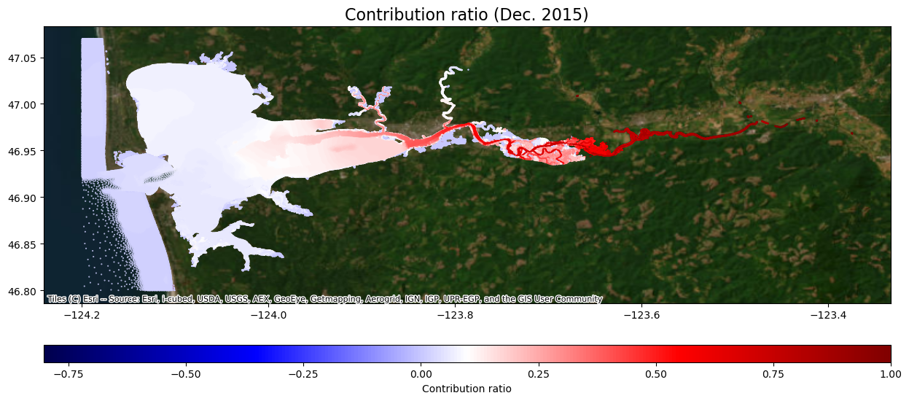
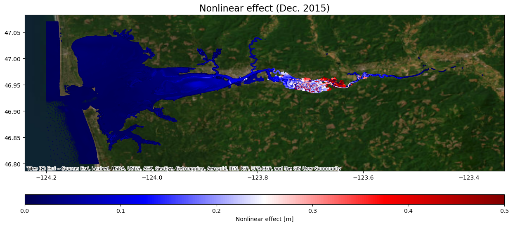
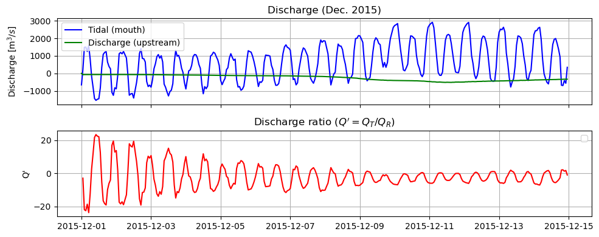
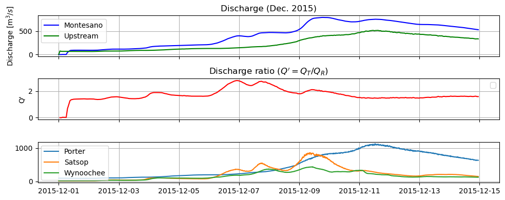
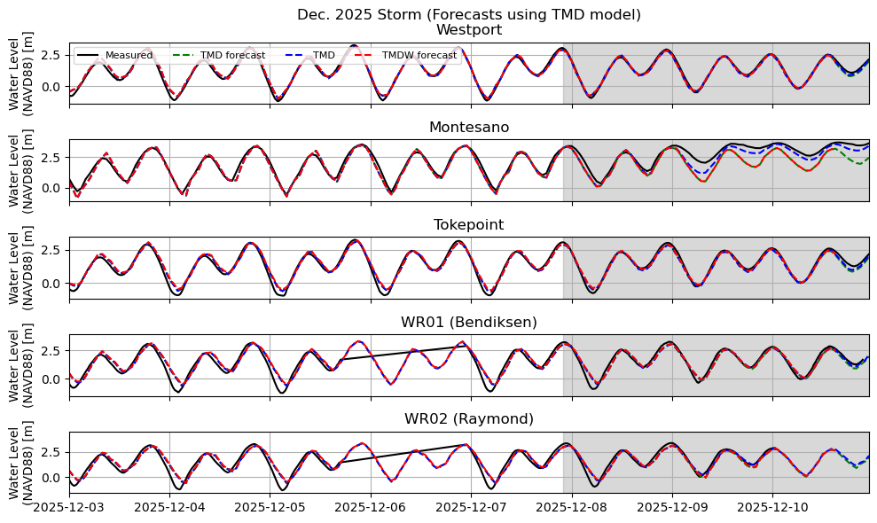

# December 14 - 20, 2025

## Summary+takeaways:
1) Dec2015 storm analysis 
* Discharge contribution shows MET influence further downstream and discharge influence further upstream
* Nonlinear effect spatial map shows compound flooding area within Grays Harbor

2) Dec2025 storm post-storm vs. forecast 
* Underpredicted forecasted river discharge rates resulted in lower water levels at Montesano

## Results:
### 1) Dec2015 storm analysis
* Can use a contribution ratio to define whether the peak water levels for each cell were dominated by inland flooding (discharge) or storm surge (MET) (Fig. 1)

 

 
Figure 1: Contribution ratio for December 2015 storm. MET influence (blue) compared with discharge influence (red).

* Nonlinear effect describes where the contribution from the interaction of tides and MET dominate (Nonlinear effect = TMD-TD-TM+T)
	* This method can be used to define a zone that reflects the largest storm-driven water level change during this event

 
Figure 2: Nonlinear effect for December 2015 storm.

* Tidal vs. River discharge (Fig. 3)
	* Comparing magnitude of tidal vs. river discharge can tell us which process controls flow moving upstream or downstream
	* Q > 0: landward flow
	* Q < 0: seaward flow
	* Q' < 0 can be a way of describing when a compound flooding event is occurring, as tidal discharge is positive (upstream flow) and river discharge is negative (downstream flow) as water is trapped somewhere in between

 
Figure 3: Discharge ratio between the mouth and upstream Chehalis River.

* Montesano vs. River discharge (Fig. 4)
	* Comparing magnitude of discharge at Montesano vs. upstream can tell us how a location within the transition zone/compound flooding zone responds to various discharge outflows throughout Chehalis River
	* Montesano measures discharge rates much greater than the upstream boundary since it acts as the confluence of Wynoochee River and upstream Chehalis River
	* Pulses in Montesano discharge are reflective more of pulses from Satsop River
	* As the river discharge from Satsop and Wynoochee dies down, discharge from Porter prolongs the compound flooding effect by maintaining elevated water levels at Montesano

 
Figure 4: Discharge ratio between Montesano and upstream Chehalis River.

### 2) Dec2025 storm post-storm vs. forecast
* Ran TMD (forecast), TMDW (forecast), and TMD (Fig. 5)
* TMD (forecast) and TMDW (forecast) were identical
* TMD (forecast) and TMD were pretty much the same amongst all locations EXCEPT for Montesano
	* However, modeled water levels at Montesano were much higher (up to ~1m) when adding in discharge rates post-storm
* Running TMDW with measured discharge rates could improve accuracy, but still would have a decent residual at Montesano and a phase shift at WR01/WR02
	* Tokepoint: up to 15cm difference
	* Montesano: TMDW underestimate bc including older discharge rates
	* Westport: up to 8cm difference
	* WR01: up to 10cm difference
	* WR02: up to 10cm difference

 
Figure 5: Comparisons between TMD forecast, TMDW forecast, TMD post-storm model, and measured water levels for the December 2025 storm

## Next steps:
* Run TMDW post-storm model for December 2025 storm