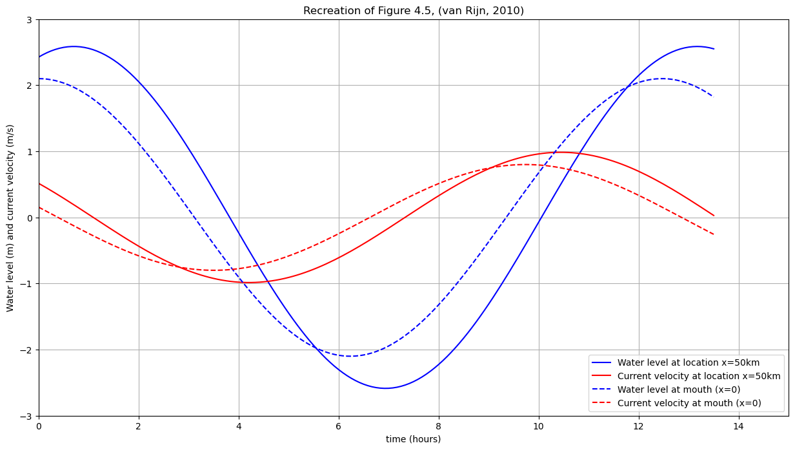
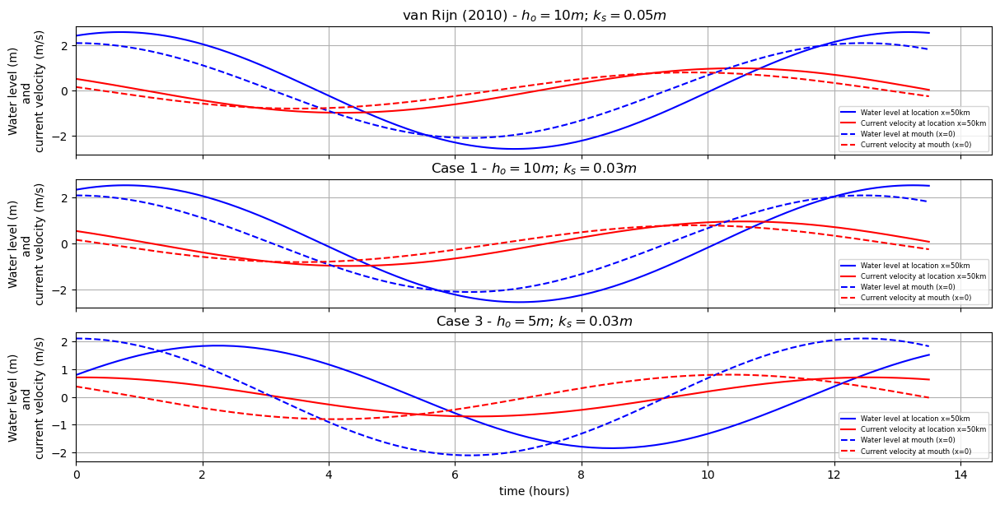
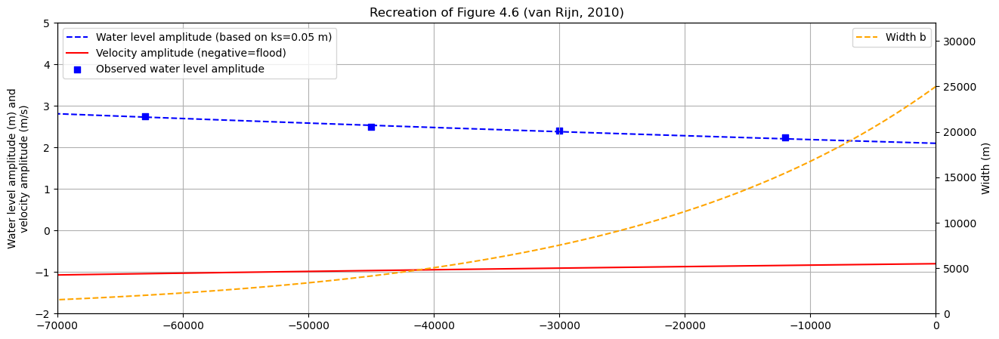

# December 15 - 21, 2024

## Summary
1) Finally got analytical model working for Scheldt!

## Results
- 
### Water level and velocity at x=0 and x=50km
- Instead of calculating u_obarhat, I used 0.8 (range for Scheldt was 0.8-1.2m/s)
	- Kept u_barhat as 0.8
- Magnitude of water level and velocity matches Figure 4.5 (Fig. 1)
- Increasing u_obarhat increases the velocity magnitude

 
 
Figure 1: Water level and velocity at x=50 km and x=0 m for k_s=0.03 m, Scheldt Estuary.

## Case 1 and Case 3 (varying depth)
- Case 1: ho=10m; ks=0.05m (Fig. 2b)
- Case 3: ho=5m; ks=0.05m (Fig. 2c)
- Upstream tidal range decreases as channel depth decreases 
- Phase of water level and velocity changes as well

 
Figure 2: Water level and current velocity for Case 1 (a,b) and Case 3 (c).

## Comparing water level amplitude with observations
- Water level amplitude and velocity amplitude plotted along channel (Fig. 3)
- Water level amplitude from analytical model agrees well with observed data (within 10%)
	- Error for Vlissingen= 1.88 %
	- Error for Terneuzen= 0.85 %
	- Error for Hansweert= 1.32 %
	- Error for Bath= 0.72 %

 
 
Figure 3: Water level amplitude and velocity amplitude along estuary, Scheldt Estuary.

## Issues

## Next steps

