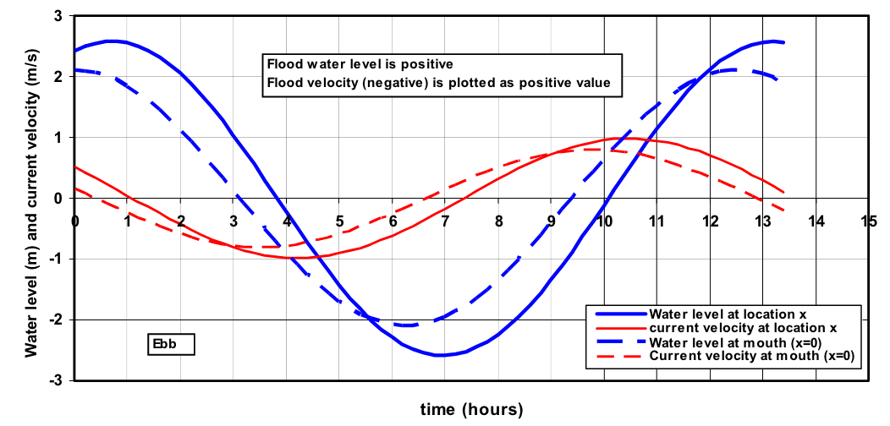
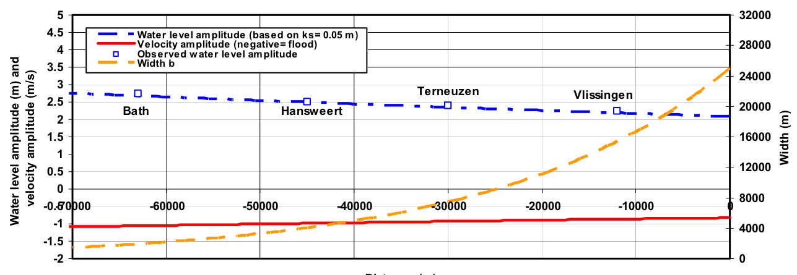
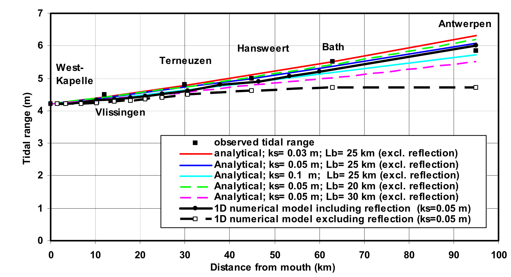
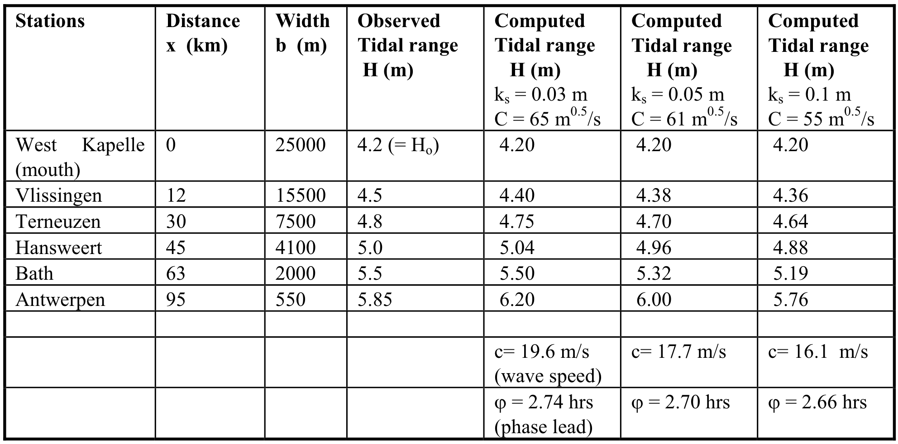
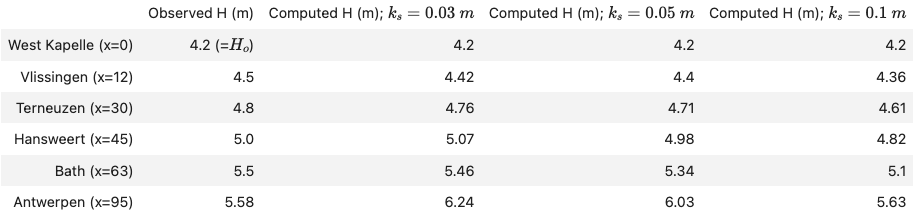
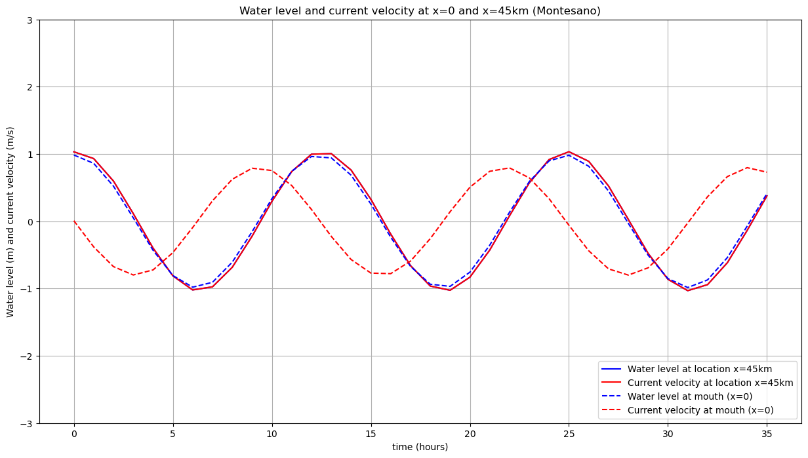
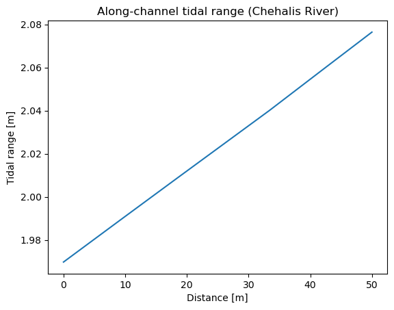

# December 15 - 21, 2024

## Summary
1) Finally got analytical model working for Scheldt!

## Results
### 1) Water level and velocity at x=0 and x=50km
- Instead of calculating u_obarhat, I used 0.8 (range for Scheldt was 0.8-1.2m/s)
	- Kept u_barhat as 0.8
- Magnitude of water level and velocity matches Figure 4.5 (Fig. 1)
- Increasing u_obarhat increases the velocity magnitude

 
 
Figure 1: Water level and velocity at x=50 km and x=0 m for k_s=0.03 m, Scheldt Estuary.

## 2) Case 1 and Case 3 (varying depth)
- Case 1: ho=10m; ks=0.05m (Fig. 2b)
- Case 3: ho=5m; ks=0.05m (Fig. 2c)
- Upstream tidal range decreases as channel depth decreases 
- Phase of water level and velocity changes as well
- Tested increasing water depth:
	- Phase lead approaches 3 hours
	- Water level and velocity becomes more uniform along channel (no amplification) and no along channel lag for water levels or velocity

 
Figure 2: Water level and current velocity for Case 1 (a,b) and Case 3 (c).

## 3) Comparing water level amplitude with observations
- Water level amplitude and velocity amplitude plotted along channel (Fig. 3)
- Water level amplitude from analytical model agrees well with observed data (within 10%)
	- Error for Vlissingen= 1.88 %
	- Error for Terneuzen= 0.85 %
	- Error for Hansweert= 1.32 %
	- Error for Bath= 0.72 %

 
 
Figure 3: Water level amplitude and velocity amplitude along estuary, Scheldt Estuary.

## 4) Tidal range along estuary for different ks values
- Increasing ks results in a reduction in upstream tidal range (Fig. 4, table 1)
	- Increasing ks -> increasing bottom friction -> smaller tidal range

 
 
Figure 4: Water level amplitude and velocity amplitude along estuary, Scheldt Estuary.

 
 
Table 1: Measured and computed tidal data (spring tide) of Scheldt Estuary based on analytical linearized method for a converging channel.

## 5) Chehalis River analytical model
- ~0.3m tidal amplification between Westport and Montesano gauge
- Phase lag of ~2.98 hours (Fig. 5)
- ~0.1m amplification in analytical model using only M2 tide (Fig. 6)

 
Figure 5: Water level and velocity at mouth (x=0) and Montesano (x=45km).

 
Figure 6: Along-channel tidal range for Chehalis River.

## Next steps
- Apply to Chehalis River
	- Add in additional tidal constituents
	- Add in compound channels
- Make list of available DSWx-S1 records for Twin Harbors and calculate statistics

