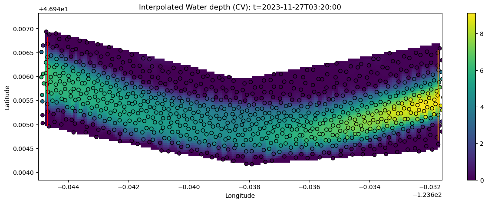
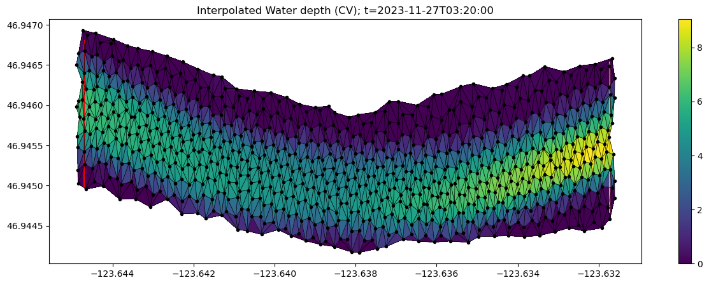
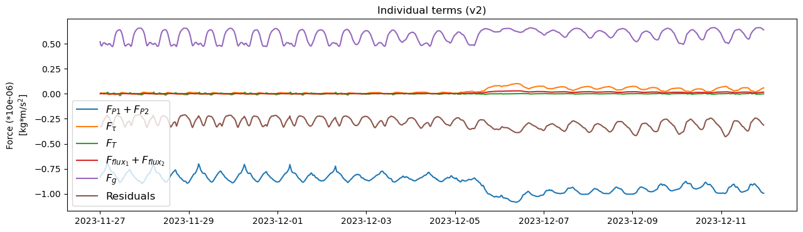
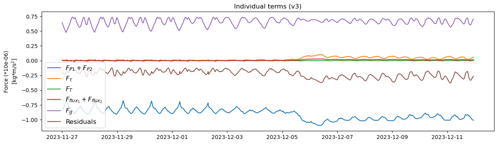
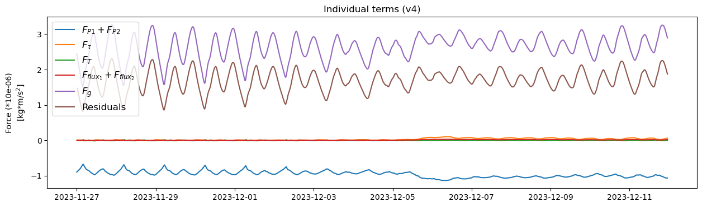
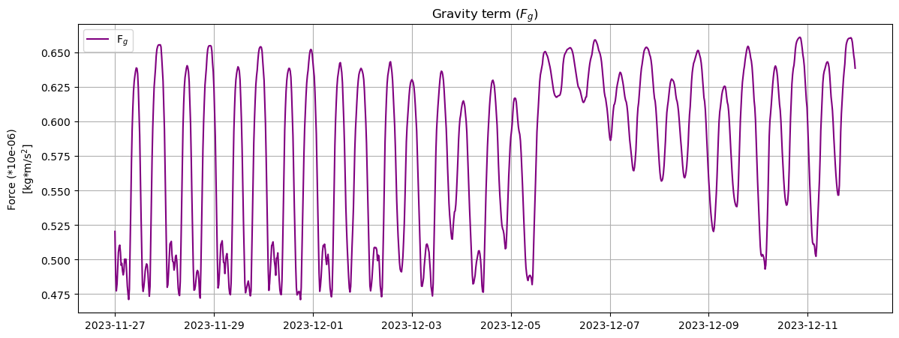
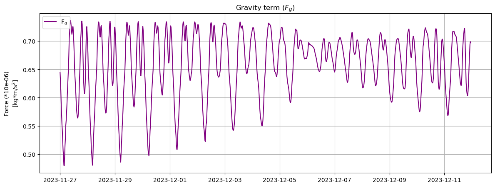
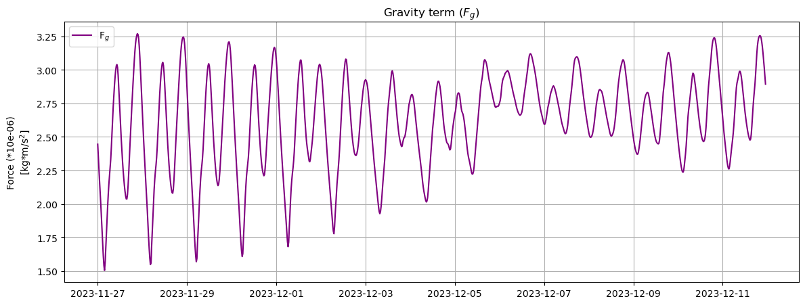
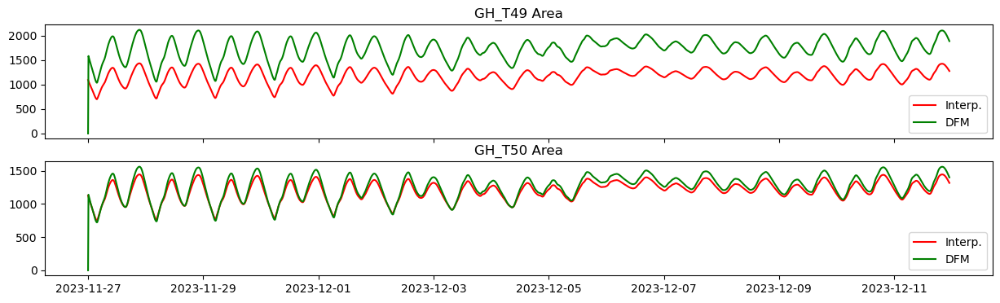

# August 08 - 16, 2025

## Summary:
* Balance is largely between gravity and pressure forces
* Tried different interpolating approaches to force balance calculations, but still "large" residual
* Most terms were relatively unchanged, except for gravity term and pressure forces
* V2, V3, and V4 refer to tabs in summary document:
	- https://docs.google.com/document/d/1Eg0rbluJZ7KoBvSvie-XAdYaMI1DoPUDk0VO89neMEI/edit?pli=1&tab=t.jeoa1hw9eb4i

## Results:
* Comparisons between 3 interpolation methods:
1) 5m x 5m (rectangular) - v2 (Fig. 1)
2) 20m x 20m (rectangular) - v3 (Fig. 2)
3) Varying (unstructured, original) - v4 (Fig. 3)

* Interpolated mesh grids for water depth on 11-27-2023T03:20:00

Figure 1: Water depth interpolated over V2 grid (5m x 5m).

Figure 2: Water depth interpolated over V3 grid (20m x 20m).

Figure 3: Water depth interpolated over V4 grid (original).

* All terms plotted against each other
	- Term that changes the most is Fg (gravity term)

Figure 4: All force balance terms (5m x 5m).

Figure 5: All force balance terms (20m x 20m).

Figure 6: All force balance terms (original).

* Gravity term calculations
	- Largest change in v4 is the estimation of slope
	- This results in an overestimation as I use the bed slope of the thalweg

Figure 7: Gravity term (5m x 5m).

Figure 8: Gravity term (20m x 20m).

Figure 9: Gravity term (original).

* Takeaways:
	- Overall, the balance is largely between the gravity term and pressure forces
	- During the flood event (~Dec. 06), the magnitude of pressure forces increase and is somewhat balanced by an increase in bed stress
	- Unsteady term, friction term, and flux term is relatively unchanged with different interpolation methods
	- Gravity term changes the most as bed slope is calculated differently between the different methods
	- One potential issue could be related to waterdepths at GH_T49
		- Calculated cross-sectional area at GH_T49 and GH_T50
		- Interpolated cross-sectional area at GH_T49 different than DFM output
		- Interpolated cross-sectional area at GH_T50 relatively similar to DFM output
		- This could change the pressure term calculation as it is dependent on the interpolated waterdepth (Fig. 10)

Figure 10: Comparing DFM cross-sectional area output against calculated area from interpolated grid (rectangular).

To do:
* OSM abstract