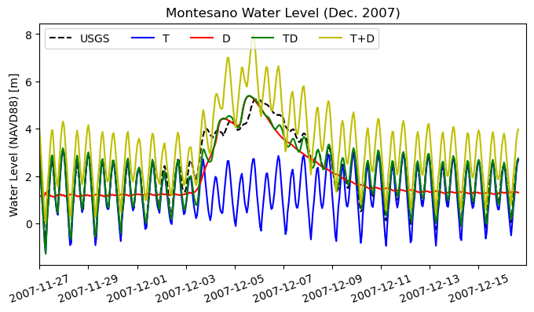
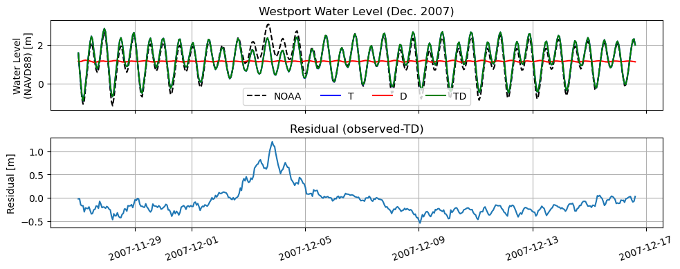
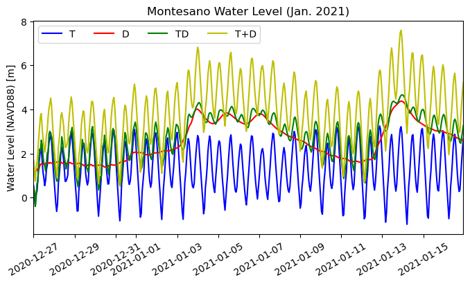
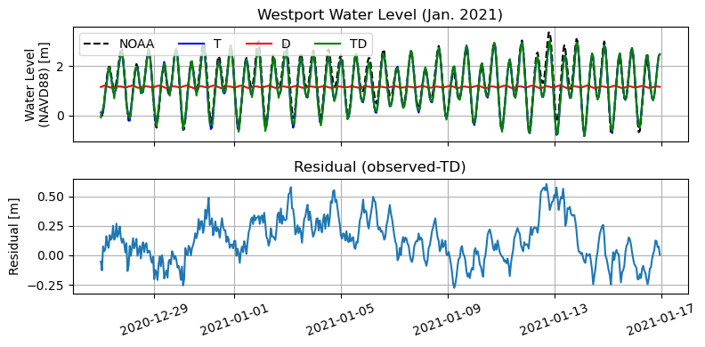
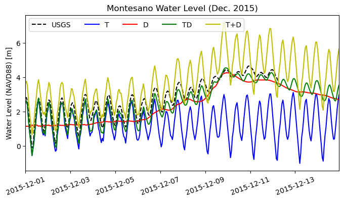
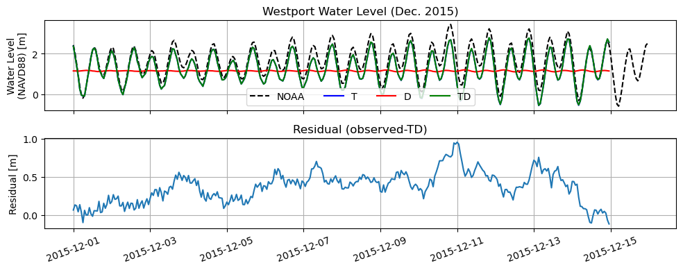
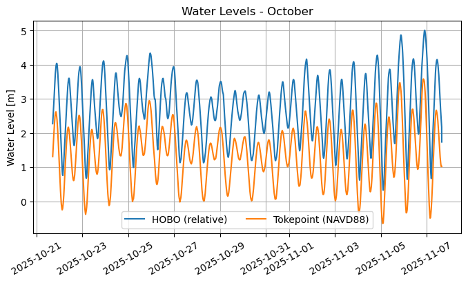
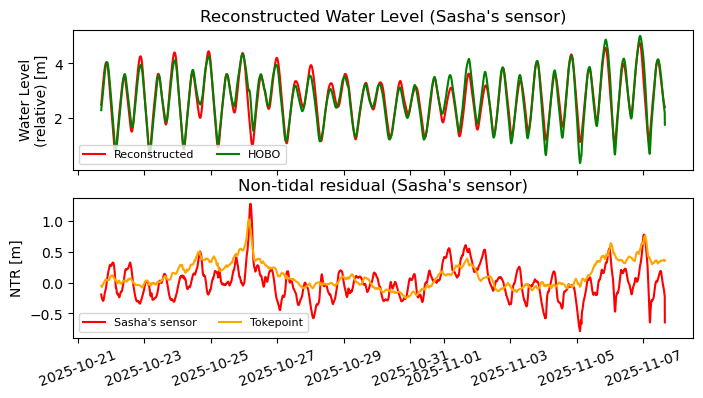

# November 30 - December 06, 2025

## Summary+takeaways:
1) Created StormID documentation with characteristics of 5 storms we want to model and available data for each storm 
2) Ran T, D, and TD model for Dec. 2007, Jan. 2021, and Dec. 2015 storms 
* Dec. 2007: storm surge (MET, waves) plays a large role in elevating water levels (>1m at Westport) 
* Jan. 2021: no Montesano gauge to validate; still a >0.5m residual at Westport station 
* Dec. 2015: water levels from TD model on average underestimates USGS water levels at Montesano; also ~1m residual at Westport gauge 
3) Plotted water level (corrected) from pre-deployment sensor (HOBO) 
* Tidal amplification observed across primary tidal constituents at upstream location (M2 = +6.35cm; M4 = +3.4cm; M6 = +4.3cm) 
* NTR at Sasha's sensor (~30km upstream of Tokepoint) shows same NTR trend as Tokepoint, indicating that storm surge influences at least up to that point

## Results:
### 1) StormID document
* https://docs.google.com/document/d/1wrkGv_q07HguVheaNbDvD7WoNb23vT04uz8LCbbjmKc/edit?tab=t.bafijae4jbtk

### 2) Dec. 2007 and Jan. 2021 storm analysis
#### Dec. 2007 storm
* TD model works best to recreate Montesano, but still missing at least 0.5m at some peaks during the storm (Fig. 1)
* Missing MET and waves could make up the difference
* Comparisons at Westport show that discharge does not play a role (Fig. 2)
* There still exists a large difference especially during peak storm period, indicating that MET or waves play a huge role in elevating water levels near the entrance of Grays Harbor (residual >1m)

 
Figure 1: Comparing water levels at Montesano between USGS gauge and model runs (T, D, and TD).

 
Figure 2: Comparing water levels at Westport between NOAA gauge and model runs (T, D, and TD) (top). Difference between observed (NOAA) and TD water levels (bottom). 

#### Jan. 2021 storm
* We do NOT have any data at Montesano to validate model, but still exhibits compound flooding signal during peak storm events (Fig. 3)
* Storm surge influence at Westport reaches up to 0.5m, so need to run period with MET data to see if difference is stemmed from local wind or offshore waves (Fig. 4)

 
Figure 3: Comparing water levels at Montesano between model runs (T, D, and TD).

 
Figure 4: Comparing water levels at Westport between NOAA gauge and model runs (T, D, and TD) (top). Difference between observed (NOAA) and TD water levels (bottom).

#### Dec. 2015
* TD model underestimates water levels at USGS Montesano gauge except for at the peak (Fig. 5)
* Water levels at Westport station is suppressed using the TD model, indicating that MET or waves play a factor (~1m at peak) (Fig. 6)

 
Figure 5: Comparing water levels at Montesano between model runs (T, D, and TD).

 
Figure 6: Comparing water levels at Westport between NOAA gauge and model runs (T, D, and TD) (top). Difference between observed (NOAA) and TD water levels (bottom).

### 3) October sensor deployment analysis
* Tidal characteristics are slightly different between Tokepoint and sensor at Sasha's location (~30km upstream) (Fig. 7)
	* 40min lag time (r=0.98)
	* M2 amplitude increased by 6.35cm and shifted in phase +11 degrees
	* M4 amplitude increased by ~3.4cm and shifted in phase +46 degrees
	* M6 amplitude also much greater (+4.3cm)
* NTR at Sasha's sensor shows same trend as Tokepoint, indicating that storm surge influences water levels up to at least this point (Fig. 8)

 
Figure 7: Water levels at Tokepoint (NAVD88) and HOBO sensor (relative depth).

 
Figure 8: Reconstructed water levels for HOBO sensor vs. measured (top). NTR calculated at Sasha's sensor vs. Tokepiont's NTR (bottom). 

## Next steps:
* Find stage-discharge relationship for Montesano to fill in gap for Dec. 2007 water levels
* Find MET data for Dec. 2007 storm
	* NCEP/NCAR Reanalysis (NNRP) vs. ERA5 vs. ECMWF?
	* https://www2.mmm.ucar.edu/wrf/users/download/free_data.html
* Run Jan. 2021, Dec. 2015, and Dec. 2007(?) with MET data

