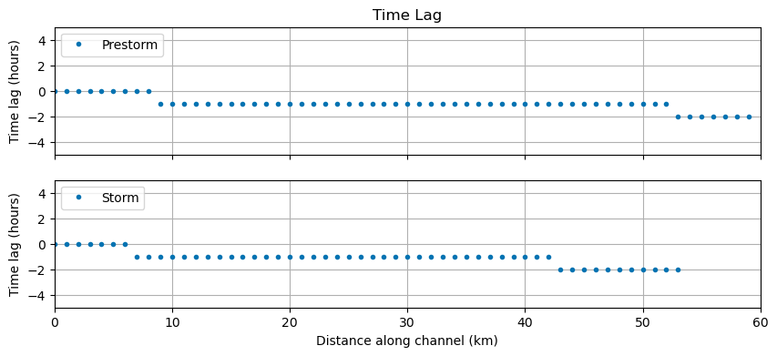
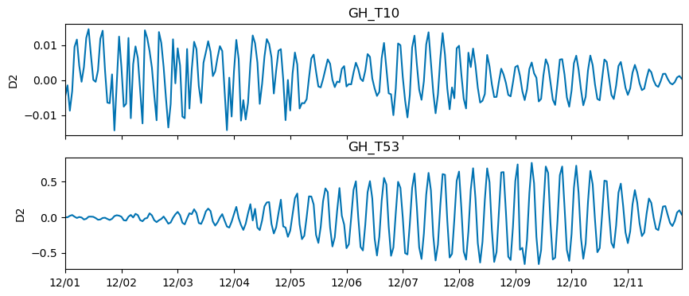
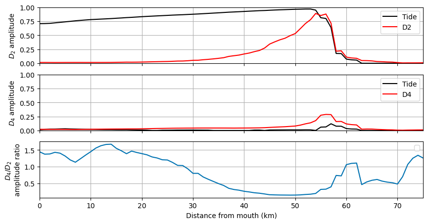

# May 10 - 16, 2026

## Discussion Points
### 1) Time lag analysis
* Goal: prove that time lag changes further upstream and that tidal distortion/amplification/dampening is changing
* By separating the time series into pre-storm and storm periods, I want to show that along channel time lag is affected by storm surge/river discharge
* Plots show that time lag increases during storm event and shifts further downstream (Fig. 1)
* Issue I'm having:
	* Only shows discrete time lag (hours)
	* Is this enough evidence for tidal distortion?
	* Should I look at individual harmonics instead of TWL?
	* How much of an influence does spring-neap variability have on this?

 
Figure 1: Along channel time lag for (a) pre-storm conditions and during (b) storm conditions. 

### 2) Max amplitude for extracted harmonic signals
* Goal: show along channel max amplitude for signals at different harmonic bands (i.e., D2, D4)
* Doing the TWL decomposition (removing tides and LFS), we get NLI
* Complex demodulation gets a time-varying signal at different harmonic bands at each station
* Issues:
	* Current method for calculating max amplitude of signal falls apart for downstream sections
	* Wave form is not symmetrical (Fig. 2)
	* Method works for upstream stations as wave group reaches peak later in time series
	* Downstream stations have noise prior to storm and are used in current method for calculating max amplitude (which is incorrect)
	* Should I only calculate for storm period? 

 
Figure 2: Time-varying D2 signal extracted from NLI signal for downstream (GH_T10) and Montesano (GH_T53).

### 3) D4/D2 amplitude ratio
* Goal: proving that energy at D2 band dominates downstream but D4 dominates as the channel converges 
* 

* Issues:
	* Opposite of intuition where D4 dominates as channel converges (Fig. 3)
	* Could be due to incorrect previous method for calculating max amplitude at each station

 
Figure 3: Comparisons of along channel max amplitude of (a) D2 signal, (b) D4 signal, and the along channel D4/D2 ratio.

## Next steps:
* Write "Intro" and "Discussion" and indicate areas that need further analysis