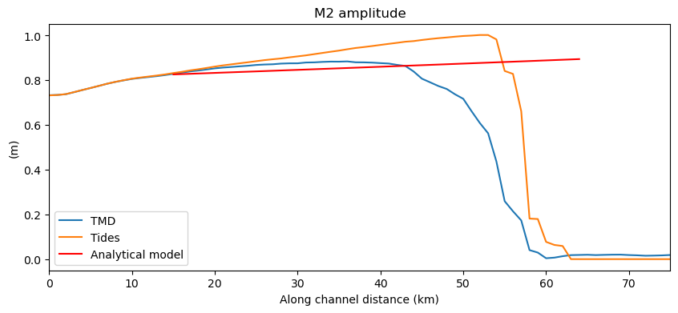
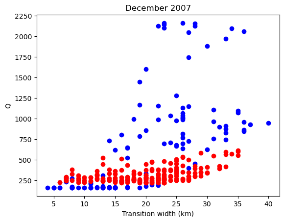
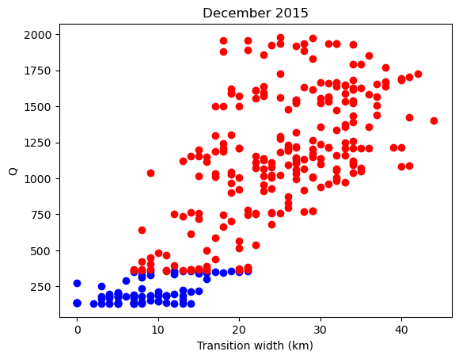
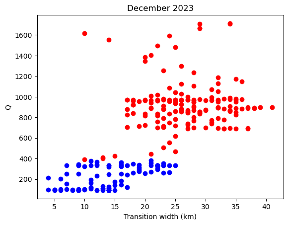
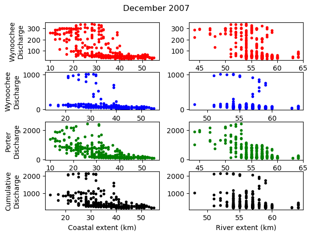
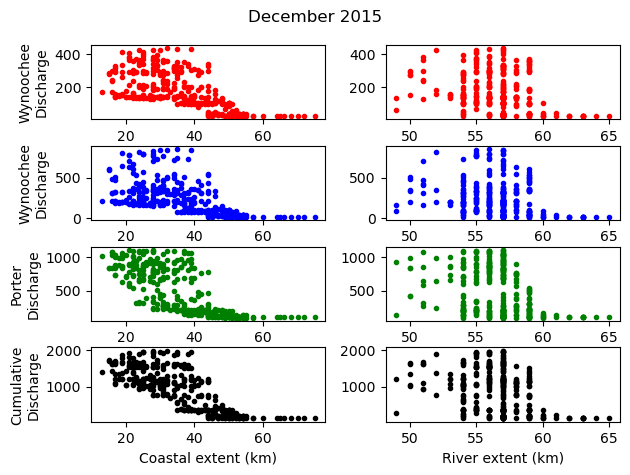
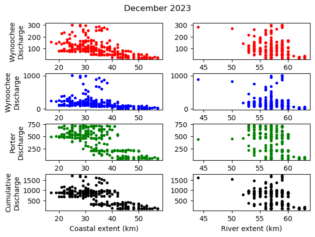
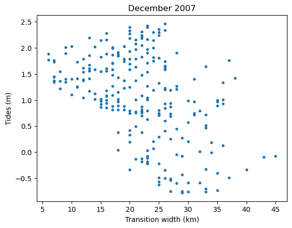
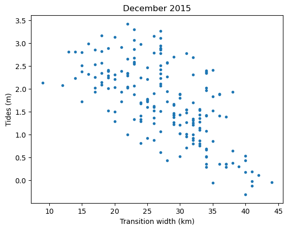
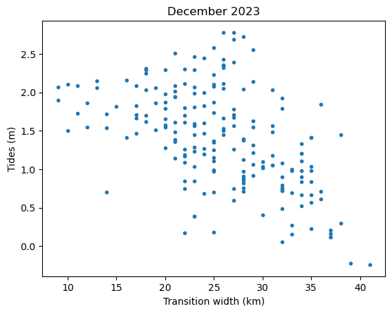

# May 31 - June 06, 2026

## Summary+takeaways:
1) Able to use analytical model to calculate alongchannel tidal amplitude (M2), but still underestimates
2) Higher Q widens transition zone and pushes coastal zone extent downstream
3) High tide also leads to narrow transition width

## Results:
#### 1) Analytical model
* Used analytical model for convergent channel, constant width, and forcing it with M2 tide to get alongchannel M2 amplitude
* Increasing  Lb (width convergence parameter) should decrease amplification, but instead increases it in this case
	* Increasing width convergence from ~8000 to 30,000 matches alongchannel M2 profile for TMD

 
Figure 1: Along channel time M2 amplitudes for TMD run (blue), tides-only run (orange), and analytical model (red).

#### 2) Increased discharge widens transition zone and pushes coastal boundary downstream
* For December 2015 and 2023, transition zone width is narrower during non-storm conditions
	* Under high flow conditions, the regime shifts up and to the right, increasing transition zone width along with discharge

 
Figure 2: Transition zone width vs. cumulative discharge for December 2007 storm. Non-storm conditions (blue) and storm conditions (red). 

 
Figure 3: Transition zone width vs. cumulative discharge for December 2015 storm. Non-storm conditions (blue) and storm conditions (red). 

 
Figure 4: Transition zone width vs. cumulative discharge for December 2023 storm. Non-storm conditions (blue) and storm conditions (red). 

* Strong relationship between discharge and coastal extent location
	* Higher discharge for Dec. 2007, 2015, and 2023 show coastal zone extent further downstream
	* No obvious relationship between river discharge and river zone extent

 
Figure 5: (Left) - Coastal zone location relative to cumulative discharge. (Right) - River zone location relative to cumulative discharge. 

 
Figure 6: (Left) - Coastal zone location relative to cumulative discharge. (Right) - River zone location relative to cumulative discharge. 

 
Figure 7: (Left) - Coastal zone location relative to cumulative discharge. (Right) - River zone location relative to cumulative discharge. 

#### 3) High tide leads to narrow transition width during storm periods
* After regime shifts up due to increased discharge, the new range of transition zone width is dependent on tidal stage
	* High tides lead to narrow transition width
	* Low tides lead to wider transition width

 
Figure 8: Transition zone width relative to tides for December 2007 storm. 

 
Figure 9: Transition zone width relative to tides for December 2015 storm. 

 
Figure 10: Transition zone width relative to tides for December 2023 storm.

