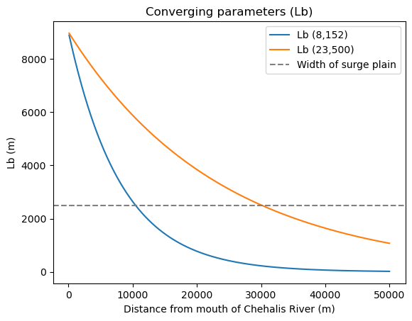
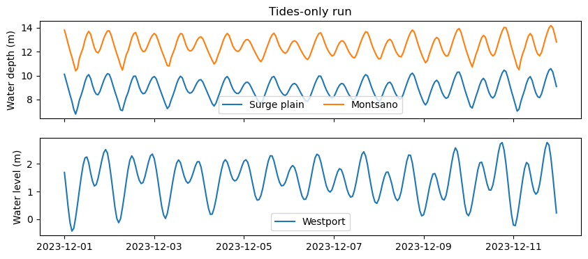

# June 07 - 13, 2026

## Summary+takeaways:
1) Channel convergence/geometry explains amplification, but not damping of the water level signal upstream

## Results:
#### 1) Exploring influence of channel geometry
* Results of van Rijn's (2011) show regimes of amplification and damping in convergent estuaries
* Using a ratio between the converging parameter and water depth (Lb/ho), he found two regimes:
	1) Lb/ho < 4,500 (strong convergent channel leading to amplified tidal range)
		* Increasing ho should make it amplified more unless some external force dampens it
	2) Lb/ho > 4,500 (shallow converging channel resulting in damped tidal range)
* Considering the Chehalis River with a Lb=8152 during normal conditions, when the surge plain floods, the width is ~2.5km which corresponds to an Lb=23,500)
* While water levels increase roughly ~0.5-1m within the surge plain, Lb/ho is still <4,500, suggesting that water levels should continue to amplify upstream still
* The damping can not be explained through convergence and water depth within the transition zone
* Conclusions:
	* Channel convergence/geometry amplifies tidal signals
	* Increasing the water depth promotes amplification 
	* However, damping of water levels is only seen upstream of GH_T56 where water depths are <3m, putting it in the damping regime

 
Figure 1: Comparison between the measured Lb (converging parameter) from Google maps and Lb with a flooded surge plain. 

 
Figure 2: Top: Water depths in the surge plain (blue) and at Montesano (orange). Bottom: Westport water levels. 